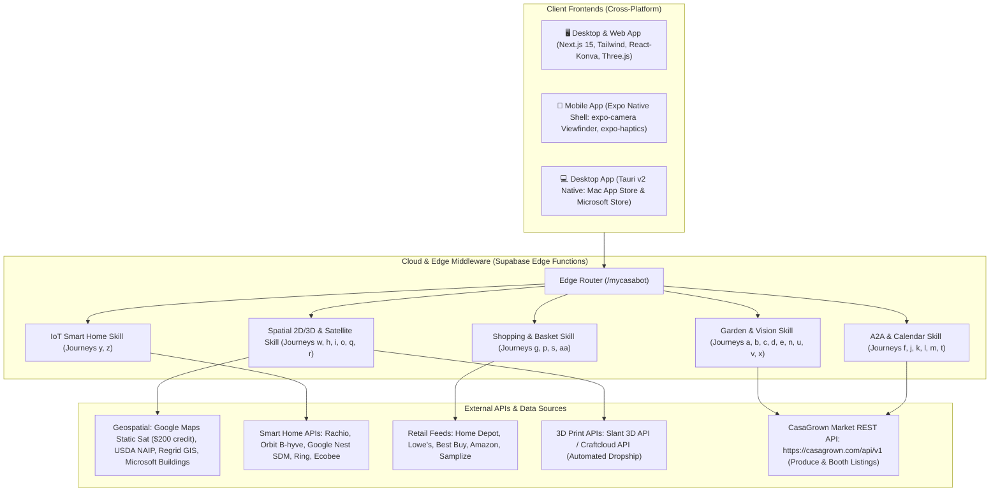

# Product Requirements Document (PRD)
# MyCasaBot — The AI Operating System for Home, Garden & Daily Living

**Document Version:** 6.0.0  
**Status:** Approved Master Specification (Production Greenfield Architecture)  
**Target Repository:** `rahulkhona/mycasabot` (Independent Greenfield Repository)  
**Target Applications:**  
- `apps/mycasabot` (Next.js 15 Web App — Deployed to `bot.casagrown.com` via Vercel)  
- `apps/mycasabot-mobile` (Expo SDK 54 Native iOS App Store & Google Play App)  
- `apps/mycasabot-desktop` (Tauri v2 Native Desktop for macOS Mac App Store, Windows Microsoft Store & Linux)  
**Backend:** Dedicated Supabase Cloud Instance (PostgreSQL 16, PostGIS, Edge Functions, Auth SSO) + Google Gemini Multimodal AI (3.5 Flash / 2.5 Flash) & Google Imagen 3  

---

## 1. Executive Summary & Product Vision

**MyCasaBot** is the everyday AI personal assistant that helps homeowners, renters, gardeners, and busy families manage, design, maintain, and enjoy their homes.

Instead of navigating complex menus or juggling 10 single-purpose apps, **every feature in MyCasaBot is an intuitive, end-to-end User Journey** triggered by natural conversation, smartphone photos, satellite parcels, smart home IoT systems, or background bot-to-bot coordination.

```
┌──────────────────────────────── MyCasaBot Super-Assistant ────────────────────────────────┐
│                                                                                           │
│   🌱 GARDEN & SATELLITE           🛋️ SPATIAL & 3D STUDIO        🔧 REPAIR & DIY           │
│   • 5-Sec Satellite Onboarding    • 2D/3D Room & Yard Design    • Photo Diagnostic AI     │
│   • Plant ID & Health Diagnosis   • Furniture Lift & Inpaint    • Step-by-Step Plans      │
│   • Backyard Photo ──► Auto-Sell  • 3D Scale Models Shipped     • 1-Click Part Checklists │
│   • Fridge Photo ──► Auto-Buy     • Cabinets, Appliances, Paint • Contractor Quote Audit  │
│                                                                                           │
│   🤖 A2A AUTONOMOUS COMMERCE      🛒 SHOPPING & DEALS           🏠 IOT & SMART AUTOMATION │
│   • Bot-to-Bot Produce Matches    • 24/7 Price Drop Sniping     • Camera Health Audits    │
│   • Zero-Knowledge Calendar Sync  • Multi-Store Basket Optimizer• Smart Drip Irrigation   │
│   • Neighborhood Tool Lending     • Utility Rebate Sniffer      • Smart Thermostat Energy │
│                                                                                           │
└───────────────────────────────────────────────────────────────────────────────────────────┘
```

## 2. High-Converting GTM Lead Pitches & Economic Pain Points

To ensure marketing dollars are never diluted across generic features, MyCasaBot's customer acquisition is driven by **5 high-ROI, high-frequency economic pain points** that offer immediate, tangible savings or relief to homeowners:

```
┌───────────────────────── The 5 High-Converting Lead Pitches ─────────────────────────┐
│                                                                                      │
│  💧 Pitch 1: The "Water Bill & Rebate Slasher" (Target: 45M+ Single-Family Homes)     │
│  • The Pain: Summer water bills hitting $300–$500/mo due to overwatering & runoff.    │
│  • The Hook: "Cut $50–$100/mo off your water bill. AI calculates exact soil & sun    │
│    zones, optimizes Rachio/sprinkler timers, and auto-claims local water rebates."   │
│  • Why It Wins: Direct financial ROI in the user's pocket; automatically indexes     │
│    their garden & fruit trees during setup!                                          │
│                                                                                      │
│  🔍 Pitch 2: The "Contractor Quote & Repair Auditor" (Target: 60M+ Homeowners)       │
│  • The Pain: Terror of getting ripped off by $1,500–$4,000 contractor repair quotes. │
│  • The Hook: "Got a contractor quote? Snap a photo. MyCasaBot audits wholesale part  │
│    costs, verifies fair labor pricing, and tells you if it's a $15 DIY fix."         │
│  • Why It Wins: High emotional relief; prevents thousands in unnecessary gouging.    │
│                                                                                      │
│  🍳 Pitch 3: The "Zero-Waste Grocery Slasher" (Target: 70M+ Busy Families)           │
│  • The Pain: Throwing away $1,500/yr in spoiled produce + $60 DoorDash fatigue.      │
│  • The Hook: "Stop throwing away $50 of spoiled groceries every week. Snap your      │
│    fridge & yard ──► 20-minute gourmet dinner in 5 seconds. Save $150/mo on food."   │
│  • Why It Wins: Daily 6:00 PM kitchen habit that connects yard produce to cooking.   │
│                                                                                      │
│  🌱 Pitch 4: The "Free Plant & Tree ER" (Target: 80M+ Gardeners / Plant Parents)     │
│  • The Pain: Yellow/dying leaves + rage over PictureThis $40/yr subscription traps.  │
│  • The Hook: "Tired of plant apps asking for $40/yr just to tell you why your leaves │
│    are yellow? Snap any sick plant for instant 100% free organic diagnosis & cure."  │
│  • Why It Wins: High emotional pain + crushes predatory $40/yr paywall competitors. │
│                                                                                      │
│  🛒 Pitch 5: The "Home Project Split-Cart Optimizer" (Target: 35M+ Weekend DIYers)   │
│  • The Pain: Paying full 40% retail markup on lumber, soil, and garden supplies.     │
│  • The Hook: "Never buy DIY project supplies at full retail. Paste your list ──►     │
│    AI splits across local bulk co-ops, Home Depot & Amazon to save $150–$300."       │
│  • Why It Wins: Immediate cash savings on every weekend home improvement project.    │
│                                                                                      │
└──────────────────────────────────────────────────────────────────────────────────────┘
```

---

## 3. The Complete Master User Journeys (A through AB)

Every capability of MyCasaBot is specified below as an explicit, step-by-step User Journey:

---

### Journey (a): Getting Expert Gardening Advice
* **User Goal**: Get actionable, reliable advice on what to plant, how to care for plants, and how to prepare soil without reading through generic gardening blogs.
* **The Trigger**: User asks: *"I want to plant tomatoes and herbs along a west-facing fence in San Jose. What should I do first?"*
* **The Flow**:
  1. MyCasaBot pulls the user's location, USDA hardiness zone (e.g. Zone 9b), current month/season, and frost dates from their profile.
  2. Generates a personalized planting guide: specific heirloom varieties that thrive locally, soil amendment advice (adding compost to clay soil), and sunlight timing (afternoon heat protection).
  3. Displays interactive follow-up chips: `[Show Planting Calendar]` `[Recommend Companion Flowers]` `[Add to Garden Memory]`.
* **Outcome**: Confidence to plant successfully with advice tailored to the user's exact microclimate.

---

### Journey (b): Diagnosing Plant Health & Curing Problems
* **User Goal**: Save a sick plant without guessing what disease or pest is killing it.
* **The Trigger**: Homeowner notices yellowing leaves with dark brown spots on their citrus tree.
* **The Flow**:
  1. User snaps a close-up photo of the damaged leaf and branches in MyCasaBot.
  2. Gemini Vision analyzes the leaf pathology and outputs a structured **`DiagnosisCard`**:
     - *Diagnosis*: Citrus Leafminer damage + mild Iron Chlorosis.
     - *Urgency*: Moderate (Action needed within 7 days).
     - *Remedy Plan*: Step 1: Spray organic cold-pressed neem oil at dusk; Step 2: Apply chelated iron foliar spray.
  3. User taps `[Order Organic Remedy Kit]` or `[Set Progress Check in 7 Days]`.
* **Outcome**: The tree is saved using non-toxic organic treatments without needing a professional arborist.

---

### Journey (c): Identifying Plants & Finding Local Buying Options
* **User Goal**: Identify an unfamiliar plant and instantly find where to buy it nearby.
* **The Trigger**: User sees a beautiful flowering shrub or fruit tree at a friend's house or park.
* **The Flow**:
  1. User snaps a photo $\rightarrow$ MyCasaBot identifies it: *"Dwarf Meyer Lemon Tree (Citrus x limon 'Meyer')"*.
  2. Renders a **`PlantSourcingCard`** showing 3 immediate buying options:
     - *Option 1 (Neighbors)*: Neighbor Elena (0.4 miles away) has two 3-gallon potted Meyer Lemon starters on CasaGrown Market for $22.
     - *Option 2 (Local Nursery)*: Payless Nursery (2.1 miles) has 5-gallon trees in stock for $45.
     - *Option 3 (Direct Delivery)*: FastGrowingTrees delivers to doorstep in 3 business days for $69.
  3. User taps `[Buy from Neighbor Elena]` $\rightarrow$ initiates 1-tap checkout.
* **Outcome**: Instant discovery and hyper-local purchase in under 60 seconds.

---

### Journey (d): Backyard Photo $\rightarrow$ Produce Sell / Giveaway Detection
* **User Goal**: Turn unharvested backyard fruit and herbs into cash or neighbor goodwill without the hassle of creating manual listings.
* **The Trigger**: User walks into their backyard on a Thursday afternoon.
* **The Flow**:
  1. User opens MyCasaBot and takes 2 wide photos of their yard.
  2. Gemini Vision scans all trees, bushes, and garden beds, detecting:
     - 1x Mature Meyer Lemon Tree (approx. 40 lbs ripe fruit).
     - 1x Rosemary Hedge (abundant cuttings).
     - 1x Fig Tree (ripening in 2 weeks).
  3. Updates the user's `user_garden` memory and presents an **`AutoListingCard`**:
     - *"We detected ~40 lbs of ripe lemons. Would you like to list them on CasaGrown Market at $2.50/lb for local porch pickup?"*
  4. User taps `[✓ Publish 10 lbs for $25]` $\rightarrow$ calls CasaGrown Market REST API (`POST /api/v1/booth/list`) to publish the booth.
* **Outcome**: An active marketplace listing created in 5 seconds from a single photo.

---

### Journey (e): Fridge Photo $\rightarrow$ Produce Buy Needs Detection
* **User Goal**: Automatically replenish fresh produce without writing out manual grocery lists.
* **The Trigger**: User is running low on groceries before the weekend.
* **The Flow**:
  1. User snaps a quick photo of the inside of their open refrigerator crisper drawer and pantry.
  2. AI analyzes inventory: detects eggs, milk, and cheese, but notices fresh salad greens, lemons, tomatoes, and herbs are completely empty.
  3. Presents an **`AutoBuyInterestCard`**:
     - *"You're out of fresh lemons, heirloom tomatoes, and basil. Would you like your CasaBot to find these fresh from local neighbors this weekend?"*
  4. User taps `[✓ Set Active Buy Interests]`.
* **Outcome**: Autonomous buy requests registered on the network without typing.

---

### Journey (f): Bot-to-Bot (A2A) Buy/Sell Negotiation & Matchmaking
* **User Goal**: Buy and sell local produce autonomously with zero back-and-forth messaging.
* **The Trigger**: Buyer's bot has active buy interests from Journey (e); Seller's bot has active listings from Journey (d).
* **The Flow**:
  1. Buyer's Bot queries the CasaGrown network: `find_produce({ item: "Meyer Lemons", qty: 10, max_price: 3.00, zip: "95125" })`.
  2. Seller's Bot matches the request and checks seller's minimum price rules ($2.00/lb).
  3. Seller's Bot counters: *$2.50/lb ($25 total), porch pickup available Friday 4–7 PM*.
  4. Buyer's Bot accepts and holds payment via Stripe.
  5. Both humans receive a simple confirmation push alert:
     - *Buyer*: *"Secured 10 lbs fresh lemons from neighbor Sarah for $25. Ready for pickup Friday at 5 PM! [Confirm]"*
     - *Seller*: *"Sold 10 lbs lemons to Mark for $25 payout. Pickup scheduled Friday at 5 PM. [Confirm]"*
* **Outcome**: A complete local transaction negotiated and finalized by AI in under 3 seconds.

---

### Journey (g): Shopping & Multi-Store Price Comparison (Basket Optimizer)
* **User Goal**: Find the absolute lowest prices and rebates for home and garden supplies without searching 10 websites.
* **The Trigger**: User plans a project requiring 4 bags of soil, cedar 2x4s, a drip irrigation timer, and a cordless drill.
* **The Flow**:
  1. User inputs their supply list into MyCasaBot.
  2. The **Smart Basket Optimizer** compares real-time prices across Home Depot, Lowe's, Amazon, local nurseries, and CasaGrown neighbors.
  3. Renders a **`SmartBasketCard`**:
     - *Single-Store Retail (Home Depot)*: $385 total.
     - *AI Split-Cart Optimized*: Lumber at Home Depot ($120) + Soil at Local Bulk Co-op ($65) + Drip Timer on Amazon ($38) + $35 Water District Rebate applied = **$188 total (Save $197!)**.
  4. User taps `[🛒 1-Click Buy Optimized Basket]`.
* **Outcome**: Hundreds of dollars saved automatically on home improvement materials.

---

### Journey (h): Room Design & Furniture Rearrangement (Scratch or Existing)
* **User Goal**: Visualize how a room looks with existing furniture moved or new items added without heavy physical lifting.
* **The Trigger**: User wants to rearrange their living room and see if a new coffee table and paint color will fit.
* **The Flow**:
  1. User performs the in-app **4-Corner Camera Sweep** (4 photos in 5 seconds).
  2. AI measures room dimensions ($18\text{ ft} \times 14\text{ ft}$) and identifies all existing furniture.
  3. On the interactive 2D/3D canvas, user taps their existing sofa. The AI cuts it out and heals the background with inpainting.
  4. User drags the sofa to the opposite wall; it scales with 3D perspective and snaps to the wall with a native haptic vibration.
  5. AI verifies clearances (*"Preserves 40-inch walkway to kitchen"*), suggests a solid oak coffee table, and applies a warm Sherwin-Williams paint palette.
  6. User taps `[✨ AI Magic Re-Render]` to see a photorealistic "After" image of the room.
* **Outcome**: Total design clarity with zero physical exertion and zero measuring mistakes.

---

### Journey (i): Landscape Design & Yard Remodeling (Scratch or Existing)
* **User Goal**: Design a beautiful, functional backyard that respects mature trees, microclimates, and water budgets.
* **The Trigger**: User wants to transform a bare or patchy yard into a vibrant outdoor space with raised beds and a patio.
* **The Flow**:
  1. User uploads yard photos or pulls satellite dimensions ($40\text{ ft} \times 25\text{ ft}$).
  2. AI identifies fixed anchors: mature lemon tree (calculates canopy shade and root protection zone), concrete patio slab, and fence lines.
  3. Organizes space into sunny edible zones (2 raised vegetable beds along south fence) and cool understory seating under the tree canopy.
  4. Generates an interactive **`LandscapeBlueprintCard`** showing 2D top-down coordinates, plant spacing, and hydrozones.
* **Outcome**: A professional, biologically harmonious landscape plan delivered in minutes.

---

### Journey (j): Calendar Integration for Pickup / Delivery Windows
* **User Goal**: Automatically schedule pickups, deliveries, and contractor appointments without manual calendar entry.
* **The Trigger**: A produce sale, tool rental, or material delivery is confirmed in MyCasaBot.
* **The Flow**:
  1. MyCasaBot checks the user's connected Google Calendar or Apple iCal for open time blocks.
  2. Proposes a pickup window that avoids work meetings and family events: *"Friday 5:00 PM – 5:30 PM"*.
  3. Once confirmed by both parties, the bot automatically creates the calendar event with address, directions, and reminder notifications.
* **Outcome**: Zero missed pickups, zero double-booking, and zero manual calendar typing.

---

### Journey (k): Family Weekend Calendar & Availability Sync
* **User Goal**: See the entire household's availability in one glance to plan weekend time together.
* **The Trigger**: Friday evening family planning.
* **The Flow**:
  1. Household members (parents, teenagers) have their individual calendars connected to MyCasaBot Family Hub.
  2. The bot aggregates schedules into a clean **`FamilyAvailabilityCard`**:
     - *Saturday Morning*: Dad free; Mom has 9 AM yoga; Kids have 10 AM soccer.
     - *Saturday Afternoon (2 PM – 6 PM)*: **100% Family Free Window**.
     - *Sunday*: Free all day.
  3. Highlights optimal time blocks for family outings, chores, or social events.
* **Outcome**: Instant visibility into family free time without conflicting commitments.

---

### Journey (l): Bot-to-Bot Social Activities & Evite/Plan Coordination
* **User Goal**: Plan dinners, BBQs, and get-togethers with friends without endless group chat polling.
* **The Trigger**: User types: *"CasaBot, plan a Saturday BBQ with the Millers and Johnsons."*
* **The Flow**:
  1. Host's CasaBot queries the Miller and Johnson family bots over the network.
  2. The bots cross-reference all 3 family calendars and local weather forecasts (filtering for sunny weather > 72°F).
  3. The bots lock in the mutual match: **Saturday at 5:30 PM (76°F, clear skies)**.
  4. Host's bot sends digital evite cards to everyone's phone with an automated potluck coordination list (*"Miller family bringing salad; Johnsons bringing drinks"*).
* **Outcome**: A 3-family dinner party planned in 1 single prompt.

---

### Journey (m): Planning Optimal Weekend Activities (Habits, Weather, Local Events)
* **User Goal**: Make the most of every weekend with a curated, personalized itinerary.
* **The Trigger**: User taps **"Plan My Weekend"** on Friday morning.
* **The Flow**:
  1. MyCasaBot synthesizes 4 data sources:
     - User's personal habits (e.g. Saturday morning workout, Sunday garden watering).
     - Local 7-day weather forecast (sunny Saturday, rainy Sunday afternoon).
     - Local neighborhood events (e.g. Campbell Farmers Market 9 AM–1 PM).
     - Confirmed family social events.
  2. Generates an **`OptimalWeekendCard`**:
     - *Sat 8:30 AM*: Morning jog & garden deep-soak (before afternoon heat).
     - *Sat 11:00 AM*: Visit local farmers market for sourdough bread.
     - *Sat 5:30 PM*: Backyard BBQ with the Millers.
     - *Sun 10:00 AM*: Assemble new cedar raised bed (free 2-hour window).
* **Outcome**: A balanced, stress-free, and productive weekend itinerary.

---

### Journey (n): DIY Home Repair Advice & Parts Checklists ("FixBot")
* **User Goal**: Diagnose and fix household plumbing, electrical, and structural issues without paying expensive contractor callout fees.
* **The Trigger**: User discovers a leaking pipe under the bathroom sink or a running toilet.
* **The Flow**:
  1. User points their phone camera at the leaking pipe for 3 seconds in FixBot.
  2. Gemini Vision detects the exact issue: *"Worn 1-1/2" slip-joint rubber washer on P-trap drain"*.
  3. FixBot displays a 4-step visual repair guide (valve shut-off, slip nut removal, washer replacement) with safety warnings.
  4. Provides a 1-click link to order the exact $2.49 replacement washer from the local Home Depot for same-day pickup.
* **Outcome**: Fixed in 15 minutes for under $3, avoiding a $200 plumbing service fee.

---

### Journey (o): Physical 3D Scale Models & Print-on-Demand Fulfillment
* **User Goal**: Hold a tangible, physical miniature scale model of a redesigned room or backyard before committing thousands of dollars to physical construction or furniture purchases.
* **The Trigger**: User finalizes their 2D/3D room remodel (Journey h) or landscape layout (Journey i/w).
* **The Flow**:
  1. User taps **"Order 3D Miniature Model"** on their design screen.
  2. **Parametric Mesh Engine**: MyCasaBot programmatically converts the spatial scene graph into a watertight, manifold `.3MF` / `.STL` mesh file at architectural scale:
     - **1:50 Scale** for Interior Rooms & Kitchens (e.g. an $18\text{ ft} \times 14\text{ ft}$ room prints as an $11\text{"} \times 8.5\text{"}$ desktop diorama).
     - **1:100 Scale** for Large Backyards (e.g. a $40\text{ ft} \times 25\text{ ft}$ yard prints as a compact $5\text{"} \times 3\text{"}$ model).
  3. **Dual-Tone Color Coding**:
     - *Existing Structures* (existing walls, fireplace, patio slab, mature tree trunks) print in neutral matte alabaster/grey.
     - *Proposed Additions* (new modular cabinets, new sectional sofa, raised garden beds, pergola) print in vibrant green, terracotta, or wood tones.
  4. **Modular "Snap-On" Physical Kit**:
     - The base plate is printed with an unobtrusive 2mm alignment grid.
     - Proposed miniature furniture pieces, kitchen islands, and raised garden beds are printed as separate modular snap-in pieces, allowing homeowners and spouses to physically pick up and rearrange pieces on their kitchen counter over morning coffee!
  5. **Three Fulfillment Pipelines**:
     - *Option 1 (Free Download)*: Instant download of sliced `.STL` / `.3MF` files for users who own 3D printers (Bambu Lab, Prusa, Creality).
     - *Option 2 ($39 Shipped Physical Diorama)*: 1-Click order dispatched via automated cloud 3D print farm APIs (**Slant 3D / Craftcloud API**) delivered to doorstep in a custom box within 3–4 business days (Production cost: ~$14.50; Net Profit: ~$24.50 per order).
     - *Option 3 (Local Neighbor 3D Printer)*: Dispatches print job to a local CasaGrown neighbor who owns a 3D printer for $20 same-day porch pickup.
* **Outcome**: Tactile delight, zero buyer's remorse, and absolute confidence reviewing a physical model with family before spending thousands on renovations.

---

### Journey (p): Budget & Monthly Water Bill / Utility Optimization
* **User Goal**: Ensure home and garden improvements never cause surprise spikes in upfront costs or monthly utility bills.
* **The Trigger**: User sets a landscape water constraint: *"Keep my added monthly water bill under $15/month."*
* **The Flow**:
  1. MyCasaBot calculates plant evapotranspiration rates and separates plantings into Hydrozones (Low-water California natives vs high-water summer veggies).
  2. Confines high-water vegetables to dedicated drip-timed raised beds so zero water is wasted on surrounding soil.
  3. Displays a live **`UtilityBudgetMeter`**:
     - *Added Water Bill*: +$11.50/month.
     - *Grocery Savings*: -$40.00/month.
     - *Net Monthly Impact*: **+$28.50/month in user's pocket**.
* **Outcome**: Guaranteed financial and environmental sustainability.

---

### Journey (q): Cabinet & Appliance Fitting Engine
* **User Goal**: Design a functional kitchen layout where all cabinets and appliances fit with exact manufacturer tolerances.
* **The Trigger**: User is remodeling a 12-foot kitchen wall run.
* **The Flow**:
  1. User inputs wall length ($144\text{ inches}$) with centered sink plumbing.
  2. The AI partitions the wall using standard 3-inch modular cabinet units: `[18" Trash Pullout] + [36" Sink Base] + [24" Dishwasher] + [30" 3-Drawer Pots Bank] + [33" Double Door Base] + [3" Filler]`.
  3. Validates the Kitchen Work Triangle and checks utility rough-ins (dedicated 240V 50A circuit for induction range, water line for fridge).
  4. Generates an itemized SKU list ready to export into an IKEA Sektion cart or custom builder cutlist.
* **Outcome**: A certified, error-free kitchen design ready for purchasing or contractor execution.

---

### Journey (r): Paint & Material Color Science
* **User Goal**: Pick paint colors that look gorgeous in the room's specific lighting without buying 10 messy paint cans.
* **The Trigger**: User wants to repaint their living room and kitchen cabinets.
* **The Flow**:
  1. AI analyzes room photo and window aspect (e.g. North-facing cool bluish daylight).
  2. Selects high-LRV (>65) warm neutral paints from Sherwin-Williams and Benjamin Moore to brighten the room.
  3. Formulates a **60-30-10 palette**: 60% Walls (SW *Alabaster*), 30% Cabinets (SW *Sea Salt*), 10% Accents (Matte Brass).
  4. User taps `[Order $5 Peel-and-Stick Swatches from Samplize]`.
* **Outcome**: Perfect color harmony tested on walls with zero paint mess.

---

### Journey (s): Neighborhood Tool & Equipment Lending Pool
* **User Goal**: Access expensive power tools for free or cheap without having to buy and store them.
* **The Trigger**: User needs a lawn aerator or pressure washer for 3 hours this Sunday.
* **The Flow**:
  1. User types: *"I need a lawn aerator this Sunday."*
  2. MyCasaBot broadcasts a request to local neighbor bots within 1.5 miles.
  3. Neighbor Dave's bot responds: *"Dave has an aerator in his garage. Free to borrow in trade for 2 lbs of fresh rosemary."*
  4. Both bots agree, schedule Sunday 9:00 AM porch pickup, and add calendar reminders.
* **Outcome**: Zero money wasted buying single-use tools; builds community goodwill.

---

### Journey (t): Gamified Family Chores & Rewards
* **User Goal**: Get kids and family members to complete household and garden chores happily without nagging.
* **The Trigger**: Daily morning household routine.
* **The Flow**:
  1. MyCasaBot assigns tasks on the kitchen smart display / iPad: *Liam (10) $\rightarrow$ Water garden bed #1; Maya (14) $\rightarrow$ Walk dog; Dad $\rightarrow$ Mow front lawn*.
  2. When Liam finishes watering, he taps `[Mark Complete]` $\rightarrow$ receives a celebratory chime and earns **20 CasaGrown Points**.
  3. Liam redeems points in the CasaGrown Reward Shop for a 3D-printed miniature toy or local market treat.
* **Outcome**: A well-maintained home with enthusiastic family participation.

---

### Journey (u): Zero-Waste Garden + Fridge Recipe Cooking
* **User Goal**: Cook delicious, healthy family meals using fresh garden produce and whatever is in the fridge before food spoils.
* **The Trigger**: 6:00 PM dinner dilemma: *"What should I cook tonight?"*
* **The Flow**:
  1. User snaps a photo of their open fridge.
  2. MyCasaBot cross-references fridge items (leftover chicken, sour cream, half an onion) with ripe garden produce from Journey (d) (fresh zucchini, basil, and thyme).
  3. In 5 seconds, outputs a **`ZeroWasteRecipeCard`**:
     - *20-Minute Creamy Lemon-Herb Skillet Chicken with Garden Zucchini*.
     - Full step-by-step cooking instructions and prep time.
* **Outcome**: Healthy gourmet dinner prepared in 20 minutes, zero food wasted, and grocery bills reduced.

---

### Journey (v): Hands-Free Voice Input & Audio Dictation
* **User Goal**: Ask questions and control MyCasaBot hands-free when hands are covered in garden soil, handling raw meat in the kitchen, or holding a wrench under the sink.
* **The Trigger**: User is in the garden with dirt on their hands or holding a tape measure.
* **The Flow**:
  1. User taps the microphone button (or uses voice activation) and speaks naturally: *"Hey CasaBot, how many inches deep do I plant these garlic cloves?"*
  2. Device's native on-device speech-to-text engine (Web Speech API / Apple Neural Engine) transcribes the speech in real time with zero latency and zero data cost.
  3. Gemini processes the query and streams both the visual response card on screen AND a concise, friendly spoken audio response.
* **Outcome**: Seamless hands-free operation in dirty, busy real-world home environments.

---

### Journey (w): Instant Address Lot Geometry (Satellite GIS) + 5-Sec Photo Verification
* **User Goal**: Get an instant, fully measured 2D backyard boundary on day one without walking outside with a tape measure.
* **The Trigger**: User enters their home address (*e.g. "123 Willow St, San Jose, CA"*).
* **The Flow**:
  1. Backend queries **County GIS / Regrid Parcel API** for the legal lot polygon and **Microsoft Open Buildings / Google Solar API** for the house footprint.
  2. Subtracts the house footprint from the lot to calculate static backyard geometry and square footage ($38\text{ ft wide} \times 26\text{ ft deep} = 988\text{ sq ft}$).
  3. App prompts user for living ground-truth: *"📸 Step outside and pan your phone for 5 seconds to capture your current trees, raised beds, and soil."*
  4. User takes a 5-second video/photo sweep $\rightarrow$ Gemini Multimodal Vision extracts current living plants, fruit load, and sun zones.
* **Outcome**: Instant lot boundaries from GIS, verified with 100% accurate, real-time plant inventory from a 5-second phone sweep.

---

### Journey (x): 5-Second Smartphone Sweep for Yard Health & Ripeness Auditing
* **User Goal**: Check backyard fruit ripening, lawn moisture, and pest health in 5 seconds without manual inspection.
* **The Trigger**: User does a periodic 5-second camera sweep of their yard or garden beds.
* **The Flow**:
  1. User holds up their phone and pans across the yard (or taps the in-app camera).
  2. Gemini Multimodal Vision audits the 48MP high-resolution frames:
     - Detects Meyer Lemons turning bright yellow (peak ripeness: ~35 lbs ready for harvest).
     - Identifies dry soil patches in Zone 2 lawn.
     - Confirms healthy new growth on rosemary and tomato beds.
  3. Presents instant actionable cards:
     - *"🍋 You have ~35 lbs of ripe lemons ready. [1-Tap Auto-List 10 lbs on CasaGrown Market for $25]"*
     - *"💧 Zone 2 lawn is drying out. [Trigger 10-Min Drip Soak on Rachio]"*
* **Outcome**: 100% accurate, real-time yard auditing in 5 seconds with zero typing and zero dependence on stale satellites or invasive cameras.

---

### Journey (y): Smart Irrigation (Drip) & Weather Control Loop
* **User Goal**: Maintain a thriving, lush garden and lawn while using the absolute minimum water necessary to keep utility bills low.
* **The Trigger**: User 5-second phone sweep detects dry soil OR local weather forecast predicts a 95°F heatwave.
* **The Flow**:
  1. MyCasaBot cross-references soil dryness with the 7-day hyper-local weather forecast and the user's monthly water budget ($15/mo cap).
  2. MyCasaBot calls the connected smart sprinkler controller API (**Rachio Public API / Orbit B-hyve / Rain Bird** via OAuth 2.0):
     - `POST /1/public/zone/start { zone_id: "zone_2_drip", duration: 600 }` (runs drip line for 10 minutes at 6:00 AM sunrise before evaporation).
  3. Sends push confirmation: *"🌿 Scheduled 10-minute early morning drip soak for your citrus trees ahead of tomorrow's 95°F heatwave."*
* **Outcome**: Zero plant death during heatwaves, automated water conservation, and low water bills.

---

### Journey (z): Smart Thermostat Energy & Time-of-Use (TOU) Optimization
* **User Goal**: Keep the home perfectly comfortable while cutting $30–$50/month off electric utility bills.
* **The Trigger**: User connects their smart thermostat (Google Nest / Ecobee / Honeywell) via OAuth 2.0.
* **The Flow**:
  1. MyCasaBot monitors local electric utility Time-of-Use (TOU) rate schedules (where electricity costs 3x more between 4:00 PM and 9:00 PM).
  2. At 2:30 PM (cheap off-peak rate), MyCasaBot pre-cools the home to 72°F.
  3. At 4:00 PM (peak expensive rate), shifts the thermostat to 76°F, letting the pre-cooled thermal mass keep the house comfortable while running zero heavy AC during expensive peak hours.
* **Outcome**: Noticeable $30–$50 monthly electric bill savings with zero sacrifice in comfort.

---

### Journey (aa): Desktop Background Helper & Distributed Residential IP Deal Sniping
* **User Goal**: Continuous 24/7 background price sniping and deal tracking using authentic home residential IP without draining mobile phone batteries.
* **The Trigger**: User installs the official MyCasaBot Desktop App from the Mac App Store / Microsoft Store (built with Tauri v2).
* **The Flow**:
  1. Desktop app runs silently in the background (macOS Menu Bar / Windows System Tray), consuming < 25 MB RAM and 0% CPU.
  2. Wakes up periodically to check user's watched items on Home Depot, Lowe's, and Best Buy using authentic local residential IP.
  3. Bypasses all cloud proxy blocks and captures exact in-store shelf prices.
  4. Syncs updated deals to Supabase $\rightarrow$ fires instant native push notification to user's iPhone / Android phone.
* **Outcome**: 100% price tracking accuracy with $0 cloud server proxy costs.

---

### Journey (ab): Fridge Door & Paper Schedule Scanner ("Magic Event & Task Import")
* **User Goal**: Digitize a messy refrigerator door covered in paper flyers, school calendars, youth sports schedules, and invitations into structured family events and chore tasks with zero manual typing.
* **The Trigger**: User snaps a photo of their refrigerator door or a paper flyer/schedule on the kitchen counter.
* **The Flow**:
  1. User snaps a photo of their refrigerator door covered in paper notices (e.g. *"Liam's Fall Soccer Schedule"*, *"Maya's School Music Concert Dates"*, *"Neighborhood BBQ Flyer"*).
  2. Gemini Multimodal Vision automatically parses all paper items in the frame:
     - Extracts event titles, dates, start/end times, and field/school locations.
     - Detects conflicts with existing family calendars.
     - Extracts actionable chore/prep tasks (e.g. *"Bring team snack on Oct 12"*, *"RSVP to Miller party by Friday"*).
  3. Presents an interactive **`MagicScheduleImportCard`**:
     - Previews all detected events color-coded by family member (Liam = Green, Maya = Purple, Family = Blue).
     - Highlights any schedule conflicts in yellow.
     - User taps `[✓ Sync 12 Events & Tasks to Family Calendar]`.
  4. Automatically dispatches the events to connected family calendars (Google, Apple iCal, Outlook) and sets automated push reminder alerts for the assigned family members.
* **Outcome**: 20 minutes of tedious manual calendar typing eliminated in a 3-second camera snap.

---

## 4. Technology Stack & Over-The-Air (OTA) Mobile Distribution

### Clean, Un-Opinionated Tech Stack (Zero Tamagui)
To guarantee 100% pixel-perfect control over every component, card, and animation without fighting opinionated styling frameworks or compiler locks, MyCasaBot is built with a **Tailwind + Radix Headless Foundation**:

```
┌────────────────────────────── The Clean Tech Stack ──────────────────────────────┐
│                                                                                  │
│  🎨 STYLING: Tailwind CSS v4 + NativeWind v4 + Radix Headless (NO Tamagui)       │
│  • 100% Un-opinionated: Write standard Tailwind classes (`bg-[#FAF9F6]`).        │
│  • Headless Primitives: Radix UI / shadcn (Zero forced library themes/styles).   │
│  • Cross-Platform NativeWind: Identical Tailwind styling across Web, iOS, Android│
│                                                                                  │
│  📱 MOBILE ENGINE: Expo SDK 54 + React Native New Architecture                   │
│  • Over-The-Air (OTA) Updates: Deploy instant bug fixes via **Expo EAS Update**  │
│    in 5 seconds without waiting 3 days for Apple/Google App Store review!        │
│  • True Native Hardware: Native in-app camera viewfinder (`expo-camera`),        │
│    Taptic engine (`expo-haptics`), native APNs push (`expo-notifications`),      │
│    and on-device speech dictation (`expo-speech-recognition`).                   │
│                                                                                  │
│  💻 DESKTOP ENGINE: Tauri v2 (Mac App Store & Microsoft Store)                  │
│  • Tiny ~8 MB binary size (vs 150 MB Electron); uses < 25 MB RAM in background.  │
│  • Sits in macOS Menu Bar / Windows System Tray with silent background auto-sync.│
│                                                                                  │
│  📐 2D / 3D SPATIAL ENGINE                                                       │
│  • 2D Blueprint Canvas: React-Konva (60 FPS hardware-accelerated canvas).        │
│  • 3D Dollhouse & AR: Three.js / React Three Fiber + Apple AR Quick Look.        │
│                                                                                  │
│  🤖 BACKEND & AI ENGINE                                                          │
│  • Database: Dedicated Supabase PostgreSQL (PostGIS, `casabot_*` tables, Auth).  │
│  • Serverless Middleware: Supabase Edge Functions (Deno / Realtime SSE Streaming)│
│  • AI Models: Gemini 3.5 Flash (Vision & Reasoning) + Google Imagen 3 (Renders). │
│                                                                                  │
│  🔌 HARDWARE & FULFILLMENT APIS                                                  │
│  • 3D Print-on-Demand: Slant 3D REST API / Craftcloud API ($24.50 profit/unit).  │
│  • Geospatial: Google Maps Static Sat ($200/mo credit) + Regrid Parcel GIS.      │
│  • Smart Home IoT: Rachio Irrigation API + Google Nest SDM API.                  │
│                                                                                  │
└──────────────────────────────────────────────────────────────────────────────────┘
```

---

## 5. Privacy, Security & Data Governance

```
┌────────────────────────── Zero-Knowledge Privacy Shield ──────────────────────────┐
│                                                                                   │
│  🔒 1. Private by Default                                                         │
│  • All 2D/3D blueprints, satellite measurements, room layouts, and camera feeds   │
│    are 100% PRIVATE to the homeowner's authenticated account.                     │
│  • Neighbors and other bots CANNOT view another user's yard dimensions or cameras.│
│                                                                                   │
│  🏡 2. Explicit "Claim Your Home" Consent                                         │
│  • During onboarding, users explicitly confirm they reside at or manage the       │
│    property before satellite parcel processing begins.                            │
│                                                                                   │
│  📍 3. Address Obfuscation on Marketplace Listings                                │
│  • When selling produce on CasaGrown Market, listings show a 0.5-mile general     │
│    neighborhood circle (e.g. "Willow Glen") until a deal is confirmed by user.    │
│                                                                                   │
│  🔑 4. Encrypted OAuth 2.0 IoT Connections                                        │
│  • Smart devices (Ring, Nest, Rachio, Ecobee) connect via user-authorized OAuth.  │
│  • Encrypted tokens stored with row-level security; 1-click revoke anytime.       │
│                                                                                   │
└───────────────────────────────────────────────────────────────────────────────────┘
```

---

## 6. Multi-App Architecture & Core Profile Synchronization

### Architecture Decision: Standalone Greenfield Repo + Unified Identity
To keep MyCasaBot completely clean, modern, and unencumbered by legacy code, **MyCasaBot is built as a separate standalone repository (`rahulkhona/mycasabot`)**, while sharing a **Unified CasaGrown Identity**:

```
┌──────────────────────── Unified Identity & Profile Synchronization ────────────────────────┐
│                                                                                            │
│  🔑 1. Unified CasaGrown ID (Single Sign-On / Single Signup)                               │
│  • Users register once via Google, Apple, Phone OTP, or Email.                             │
│  • Single login credentials work across both MyCasaBot and CasaGrown Market.               │
│                                                                                            │
│  🔄 2. Core Profile Fields Synchronized                                                    │
│  • `full_name`, `email`, `phone_number`                                                    │
│  • `street_address`, `city`, `state_code`, `zip_code`                                      │
│  • `home_location` (PostGIS exact rooftop coordinates)                                     │
│  • `home_community_h3_index` (H3 neighborhood cell)                                        │
│  ──► Updating primary home address in either app automatically syncs the core profile!     │
│                                                                                            │
│  🛡️ 3. App-Specific Namespaced Data Isolation (`casabot_*`)                                 │
│  • All 3D spaces, shopping watchers, chores, and IoT devices live in `casabot_*` tables.   │
│  • Zero pollution or schema coupling with legacy marketplace tables.                       │
│                                                                                            │
│  🏡 4. Multi-Property / Space Management (No Overwrite Confusion)                          │
│  • Users can design multiple independent spaces (e.g. Vacation Home, Parents' Garden)      │
│    without changing their Primary Residence marketplace seller booth address.              │
│                                                                                            │
│  💬 5. Transparent User Interface                                                          │
│  • Profile settings display: "CasaGrown Universal Account".                                │
│  • Address edits display: "📍 Synced across your CasaGrown Market booth and garden spaces." │
│                                                                                            │
└────────────────────────────────────────────────────────────────────────────────────────────┘
```

---

## 7. Technical Architecture & Database Schemas



### PostgreSQL Database Schema Additions

```sql
-- 1. Saved Spatial Blueprints, Satellite Parcels & Room Designs
CREATE TABLE casabot_spaces (
    id UUID PRIMARY KEY DEFAULT gen_random_uuid(),
    user_id UUID NOT NULL,
    name TEXT NOT NULL,
    space_type TEXT NOT NULL CHECK (space_type IN ('backyard', 'frontyard', 'kitchen', 'living_room', 'bedroom', 'office')),
    dimensions_ft JSONB NOT NULL, -- { width: 38, depth: 26, height: 9, area_sqft: 988 }
    parcel_polygon JSONB,         -- Legal lot boundary GeoJSON
    building_polygon JSONB,       -- House footprint GeoJSON
    sunlight_zones JSONB,         -- { full_sun_sqft: 420, partial_shade_sqft: 350, deep_shade_sqft: 218 }
    layout_state JSONB NOT NULL,  -- Array of objects with x, y, z, rotation, metadata
    satellite_image_url TEXT,
    rendered_image_url TEXT,
    stl_model_url TEXT,
    created_at TIMESTAMPTZ DEFAULT now(),
    updated_at TIMESTAMPTZ DEFAULT now()
);

-- 2. Smart Home IoT Device Connections (Rachio, Nest, Ring, Ecobee)
CREATE TABLE casabot_iot_devices (
    id UUID PRIMARY KEY DEFAULT gen_random_uuid(),
    user_id UUID NOT NULL,
    device_type TEXT NOT NULL CHECK (device_type IN ('irrigation', 'thermostat', 'camera', 'weather_station')),
    provider TEXT NOT NULL CHECK (provider IN ('rachio', 'bhyve', 'nest', 'ecobee', 'ring', 'arlo')),
    device_name TEXT NOT NULL,
    oauth_access_token_encrypted TEXT NOT NULL,
    oauth_refresh_token_encrypted TEXT NOT NULL,
    zone_mappings JSONB DEFAULT '{}', -- { "zone_2": "backyard_citrus_drip" }
    is_active BOOLEAN DEFAULT true,
    last_sync_at TIMESTAMPTZ,
    created_at TIMESTAMPTZ DEFAULT now()
);

-- 3. Background Shopping Watchers & Price Drops
CREATE TABLE casabot_shopping_watchers (
    id UUID PRIMARY KEY DEFAULT gen_random_uuid(),
    user_id UUID NOT NULL,
    item_query TEXT NOT NULL,
    category TEXT NOT NULL,
    target_price_usd NUMERIC(10,2),
    current_best_price_usd NUMERIC(10,2),
    best_retailer TEXT,
    best_product_url TEXT,
    status TEXT DEFAULT 'active' CHECK (status IN ('active', 'triggered', 'purchased', 'archived')),
    created_at TIMESTAMPTZ DEFAULT now()
);

-- 4. Household Chores & Family Tasks
CREATE TABLE casabot_chores (
    id UUID PRIMARY KEY DEFAULT gen_random_uuid(),
    household_id UUID NOT NULL,
    assigned_to UUID,
    title TEXT NOT NULL,
    category TEXT CHECK (category IN ('garden', 'maintenance', 'cleaning', 'pets')),
    reward_points INT DEFAULT 10,
    recurrence TEXT DEFAULT 'weekly',
    due_date DATE,
    completed_at TIMESTAMPTZ,
    created_at TIMESTAMPTZ DEFAULT now()
);

-- 5. Agent-to-Agent (A2A) Interaction Logs & Intent Blackboard
CREATE TABLE casabot_a2a_intents (
    id UUID PRIMARY KEY DEFAULT gen_random_uuid(),
    initiator_id UUID,
    target_id UUID,
    intent_type TEXT NOT NULL CHECK (intent_type IN ('buy_bid', 'sell_offer', 'calendar_invite', 'tool_lending')),
    payload JSONB NOT NULL,
    status TEXT DEFAULT 'pending' CHECK (status IN ('pending', 'negotiating', 'agreed', 'rejected', 'completed')),
    created_at TIMESTAMPTZ DEFAULT now()
);

-- 6. Tool & Equipment Lending Pool
CREATE TABLE casabot_tools (
    id UUID PRIMARY KEY DEFAULT gen_random_uuid(),
    owner_id UUID NOT NULL,
    name TEXT NOT NULL,
    category TEXT NOT NULL,
    daily_fee_usd NUMERIC(10,2) DEFAULT 0.00,
    trade_preference TEXT,
    is_available BOOLEAN DEFAULT true,
    created_at TIMESTAMPTZ DEFAULT now()
);
```

---

## 8. Monetization Strategy (Free Core App + High-Value Transactions)

### Strategic Philosophy: "100% Free Core App $\rightarrow$ Monetize High-Intent Actions"
To maximize viral word-of-mouth growth and eliminate download friction, **MyCasaBot is 100% free to download and use** for daily gardening advice, plant diagnosis, satellite yard mapping, room planning, and chore tracking. Revenue is generated purely on high-intent transaction moments:

| Revenue Stream | Mechanism & Value Delivery | Margin / Take Rate |
|---|---|---|
| **🛒 E-Commerce & Retail Affiliates (Journeys g, q, r, n)** | 1-Click checkout for furniture, appliances, lumber, paint, and repair tools via Skimlinks / Impact / merchant feeds. | **5% – 12% CPA commission** (e.g. $100–$400 on a $3,000 project) |
| **🏗️ 3D Scale Models Shipped (Journey o)** | $39 to $79 retail charge for physical 1:50 miniature dioramas fulfilled via automated cloud print APIs (**Slant 3D / Craftcloud**). | **50% – 60% gross profit margin** (~$24.50 net profit per order) |
| **🔨 Hiring Verified Local Pros (Journeys i, n, q)** | Connecting homeowners with vetted local landscape contractors, painters, plumbers, and handymen for installation. | **$50 – $150 per qualified lead** (or 5%–10% of booked job) |
| **🍋 Hyper-Local Marketplace (Journeys d, f, s)** | Transaction fee on neighbor-to-neighbor produce sales, seed swaps, and power tool lending rentals. | **10% – 15% marketplace take rate** |
| **⭐ Optional Power-User Pro Tier (Journeys k, l, m)** | Optional $9.99/mo or $79/yr membership for power households wanting 24/7 autonomous deal sniping and unlimited 3D cloud renders. | **High-margin recurring SaaS** |

---

## 9. Development Timeline & Estimation (Delight-First Unified Release)

### Total Estimated Duration: **8 to 10 Weeks** (Complete Production App)

```
┌────────────────────────── Implementation Roadmap ──────────────────────────┐
│                                                                            │
│  [Weeks 1–2]: App Shell, Satellite Onboarding & Conversational AI Core    │
│  • Scaffold `apps/mycasabot` (Next.js 15), `apps/mycasabot-mobile` (Expo), │
│    and `apps/mycasabot-desktop` (Tauri v2).                                │
│  • Implement 5-second Satellite & Parcel onboarding (Journey w).           │
│  • Wire streaming chat with Gemini 3.5 Flash & dynamic card renderer.      │
│  • Build native in-app 4-corner camera burst viewfinder (`expo-camera`).   │
│  • Implement Journeys (a, b, c, d, e, n, u, v).                            │
│                                                                            │
│  [Weeks 3–4]: Spatial 2D/3D Studio & Photo Measurement                     │
│  • Implement photo anchor calibration & metric depth estimation.           │
│  • Build 2D/3D interactive canvas with 60-120fps perspective dragging.     │
│  • Implement SAM object cutout + LaMa background inpainting.               │
│  • Implement Journeys (h, i) & Imagen 3 photorealistic re-renders.         │
│                                                                            │
│  [Weeks 5–6]: Cabinets, Paint & 3D Print-on-Demand                         │
│  • Build NKBA modular 3" cabinet partitioner & appliance clearance checks. │
│  • Implement Sherwin-Williams/Benjamin Moore paint LRV palette generator.  │
│  • Build parametric STL/3MF mesh exporter & Slant 3D/Craftcloud API hook.  │
│  • Implement Journeys (o, p, q, r).                                        │
│                                                                            │
│  [Weeks 7–8]: Shopping Engine, Smart Home IoT & Family Hub                 │
│  • Implement 24/7 background price tracking & split-cart optimizer.        │
│  • Implement Smart Home IoT: Rachio drip control & Nest thermostat (y, z). │
│  • Implement Camera daily health audit (Journey x).                        │
│  • Build Agent-to-Agent (A2A) calendar scheduling & produce matching.      │
│  • Implement Family Hub, gamified chores, and CasaGrown Points.            │
│  • Implement Journeys (f, g, j, k, l, m, s, t, aa).                        │
│                                                                            │
│  [Weeks 9–10]: Dual-Suite Automated Testing, Polish & Launch               │
│  • Playwright end-to-end web/desktop test suite.                           │
│  • Jest-Expo / Maestro native camera and gesture test suite.               │
│  • Security audits, privacy verification, and production launch.           │
│                                                                            │
└────────────────────────────────────────────────────────────────────────────┘
```

---

## 10. Next Steps to Start Execution

1. **Repository Setup**: Initialize GitHub repo `rahulkhona/mycasabot`.
2. **Design System**: Establish the clean design tokens (warm alabaster, pine, typography, card borders).
3. **Database Setup**: Connect clean Supabase project and run the migration for `casabot_spaces`, `casabot_iot_devices`, `casabot_shopping_watchers`, `casabot_chores`, and `casabot_tools`.
4. **Core Assistant Shell & Native Camera**: Build the 4-tab shell and native 4-corner camera sweep.

---

## 11. Antigravity Handoff Guide (For Another Machine / Session)

To load 100% of this context into another Antigravity session or on another development machine:

1. **Copy this PRD**: Place this file at `docs/MYCASABOT_PRD.md` in the new project.
2. **Add Workspace Rules**: Create `.agents/AGENTS.md` containing:
   ```markdown
   # MyCasaBot Workspace Rules
   - Single Source of Truth: Read `docs/MYCASABOT_PRD.md` before writing any code.
   - Tech Stack: Next.js 15, React 19, Tailwind CSS v4, NativeWind v4, Expo SDK 54, Tauri v2.
   - Design System: Warm Alabaster (`#FAF9F6`), Deep Pine (`#1B4332`), Warm Terracotta (`#C86446`).
   - Testing: Run automated tests locally before declaring completion.
   ```
3. **Kickoff Prompt**: When starting the new Antigravity session, simply type:
   > *"I am starting development of MyCasaBot. Please read `docs/MYCASABOT_PRD.md` in full to load all 27 user journeys and architectural specifications, and let's scaffold Phase 1."*
