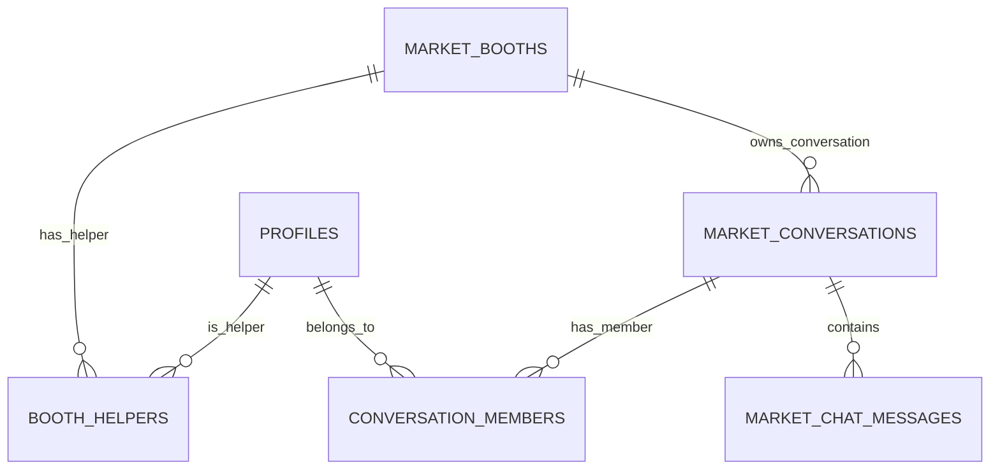

# Design Document: Collaborative Messaging Inbox (Group Escalation & ACLs)

This document outlines the architecture for refactoring the chat system from a strict **1-to-1 User DM** model to a **1-to-Many Entity/Group** model. This allows casual booth helpers to claim chats, hand off conversations, and invite specialized users, while maintaining a clean, backward-compatible migration path for existing DMs.

### 💡 Unified Architecture: Support as a Booth
To keep the architecture simple and robust, **we do not need special handling for support staff.** 
* The `support@casagrown.com` account is treated just like a standard merchant/booth.
* Other support agents are invited as **booth helpers** to the support account using the existing `booth_helpers` relationship.
* This allows the exact same claim, hand-off, and ACL access rules to govern support chats without any custom support tables or custom RLS policies.

---

## Architecture Diagram

---

## Proposed Database Schema & Migration

### 1. Table Alterations and Additions
- **Modify `market_conversations` table:**
  - Add nullable `booth_id` (UUID referencing `market_booths`).
  - Add nullable `assigned_to` (UUID referencing `profiles`).
- **Create `conversation_members` table:**
  - Columns: `conversation_id` (UUID), `user_id` (UUID), `role` (TEXT), `added_by` (UUID), `added_at` (TIMESTAMPTZ).
  - Primary Key: `(conversation_id, user_id)`.

### 2. Data Migration Script
- Select all existing rows from `market_conversations`.
- Insert two rows into `conversation_members` for each existing conversation (`participant_a` and `participant_b`).

### 3. Atomic Database Functions
- `claim_conversation(p_conversation_id UUID, p_user_id UUID)`: Attempts to set `assigned_to = p_user_id` where `assigned_to IS NULL`. Returns updated row count.
- `reassign_conversation(p_conversation_id UUID, p_from_id UUID, p_to_id UUID)`: Atomic re-assignment of the chat, logging a system message: *"Transferred conversation to [Name]"*.
- `invite_to_conversation(p_conversation_id UUID, p_user_id UUID, p_added_by UUID)`: Inserts a row in `conversation_members` and writes a system message: *"[Inviter] invited [Specialist] to this chat."*.

### 4. Row Level Security (RLS)
- Update `market_conversations` and `market_chat_messages` policies to allow access to users in `conversation_members` or active helpers/owners of `booth_id`.

---

## Frontend Integration

### 1. Messages Inbox List (`/messages/page.tsx`)
- Update conversations query to load all threads where:
  - The user is in `conversation_members` (standard DMs & collaborations).
  - OR the chat belongs to a booth they own/help manage (`booth_id` checks).
- Show ownership indicators on each conversation card (e.g. `⏳ Unassigned` or `Claimed by Sarah`).
- Update the realtime channel subscription to listen to `conversation_members` inserts.

### 2. Frontend Chat Thread (`/messages/[id]/page.tsx`)
- **Metadata Initialization:**
  - Load all participant profiles from `conversation_members`.
  - Determine active role/permissions (e.g., if the user is a helper, specialist, or the customer).
- **Claim & Takeover UI Header Bar:**
  - If `assigned_to` is NULL: Display a green banner: **`🙋‍♂️ Claim Chat to Reply`** (with auto-claim fallback when typing).
  - If `assigned_to` is set to someone else: Lock the input text area and display: **`🔒 Claimed by [Helper Name]`** with a **`Take Over`** action link.
- **Handoff & Collaboration Side Drawer:**
  - Add a **"Collaborate & Hand Off"** menu in the header.
  - Show options to:
    - **Reassign:** Transfer ownership to another helper at the booth.
    - **Invite Specialist:** Search profiles and add them to `conversation_members` as an expert.
- **System Message Rendering:**
  - Render system-audit messages (`is_system === true`) with a distinct, centered, light gray container (e.g., *"Helper Sarah joined the chat"*).

---

## Verification Plan

### Automated Tests
1. **DB Function Tests:**
   Write pgTAP tests in `supabase/tests/collaborative_messaging.test.sql` to verify:
   - Concurrency claims (`claim_conversation` succeeds for the first transaction and returns 0 for concurrent attempts).
   - Reassignment and system-audit log insertions.
   - ACL memberships and RLS query policies.
2. **Vitest Unit Tests:**
   - Verify `MessagesInboxPage` correctly groups and renders unassigned vs. claimed channels.

### Manual Verification
1. **Race Condition Simulation:**
   - Open two browser windows logged in as different helpers.
   - Send a message from a customer account.
   - Click "Claim Chat" in both windows at the same time. Confirm only one helper succeeds, and the other window's UI immediately locks and displays the "Claimed by [Name]" notice.
2. **Invite Specialist Flow:**
   - Log in as Helper A, claim the chat, and click "Invite Collaborator".
   - Select Helper B (or a specialist account).
   - Verify that the chat appears in Helper B's inbox, and Helper B can now view and participate in the thread.
