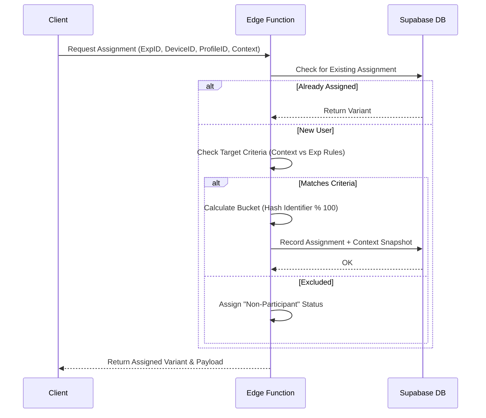

# Experimentation System Design

## Overview
A robust, cross-platform experimentation (A/B testing) framework for CasaGrown. The system supports both authenticated users and guests, ensuring consistent variant assignment and precise targeting across Web, iOS, and Android.

## Core Principles

### 1. Deterministic Hashing (Zero-Flicker Assignment)
Instead of assigning variants randomly and storing them immediately, we use **deterministic bucketing**.
- **Input**: `ExperimentID + Identifier (ProfileID or DeviceID) + Salt`
- **Algorithm**: MurmurHash3 or SHA-256 (e.g., `hash % 100`).
- **Benefit**: A user is guaranteed to stay in the same group across sessions and devices without needing a synchronous database call before rendering.

### 2. Guest & Authenticated Support
- **Guests**: Assignment is tied to `device_id`.
- **Authenticated**: Assignment is tied to `profile_id`.
- **Bridging**: When a guest logs in, the `device_id` assignment is persisted to the new `profile_id` to prevent variant transitions mid-session.

### 3. Segment-Aware Targeting & Stratification
Assignments are made using real-time device metadata provided by the client.

#### Targeting Criteria
Experiments can be constrained by:
- `platform` (ios, android, web)
- `os_version` (e.g., >= 17.0)
- `device_model` (e.g., iPhone 15)
- `locale` (e.g., en-US)

#### Natural Stratification
The hashing algorithm is mathematically uniform. Within any subset (e.g., just "Android users"), the 50/50 split (or weighted split) will naturally hold true.

## Data Model

### `experiments`
Defines the test, targeting rules, and current status.
- `target_criteria`: JSONB containing OS/Platform/Model requirements.

### `experiment_variants`
The specific buckets (e.g., "Control", "Treatment A").
- `weight`: Percentage of the total traffic (0-100).

### `experiment_assignments`
Records the specific snapshot of an assignment.
- `user_id`: UUID (Nullable for guests).
- `device_id`: Text (Required).
- `context`: JSONB snapshot of the device metadata at assignment time (OS, Version, Model).
- **Check**: `CHECK (user_id IS NOT NULL OR device_id IS NOT NULL)`.

### `experiment_events`
Tracks conversions and interactions tied to the variant.

## Assignment Flow

## Implementation Strategy
1. **Schema Migration**: Updates `experiment_assignments` for nullability and context.
2. **Edge Function**: Centralized logic in `supabase/functions/assign-experiment`.
3. **Client Library**: Shared hook in `@casagrown/app` to handle fetching and local caching of assignments.
