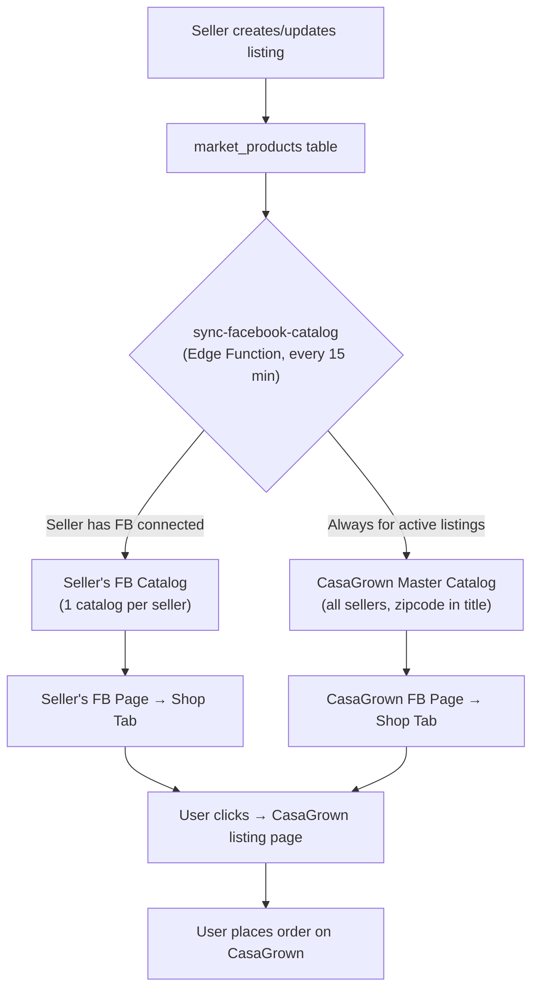

# Facebook Commerce Integration Plan

> [!NOTE]
> **Scope**: Facebook only. X/Twitter and Nextdoor deferred — sellers use our existing social sharing widget.

---

## Goal

1. Each seller syncs their CasaGrown listings to **their own Facebook Page Shop** (1 catalog per seller)
2. All listings aggregated into a **CasaGrown master catalog** on our Facebook Page, searchable by zipcode
3. All checkout happens on **CasaGrown** (offsite checkout — no Facebook Checkout)
4. Listing pages have **rich OG meta tags** so every shared link looks professional

---

## Key Decisions

| Question | Decision |
|---|---|
| Catalogs per seller | **1 catalog per seller account** |
| What do we link to? | **CasaGrown listing pages** (not product pages — we don't have standalone product pages) |
| Where does checkout happen? | **On CasaGrown** — Facebook redirects to our listing page |
| How do people search by location? | **Zipcode appended to product title** on Facebook (e.g. "Fresh Tomatoes · 95112") |
| How do people browse by category? | **Collections** organized by category (Produce, Baked Goods, etc.) |
| Master catalog branding? | **Attributed to each seller** — booth name in `brand` field |
| Business Manager? | We already have a Facebook Business Page — **Business Manager is just the admin panel** at business.facebook.com |
| Product photos | **Already publicly accessible** on CasaGrown — no changes needed |
| Supabase compute | **Already have account** — no additional cost |

---

## How Search Works on Facebook Shop

Facebook Shop has a search bar that matches against product **name** and **description**. There are no location filters. Our strategy:

| User Action | What They Type | What Matches |
|---|---|---|
| Find by product | `tomatoes` | Product name: "Fresh Heirloom **Tomatoes** · 95112" |
| Find by zipcode | `95112` | Product name: "Fresh Heirloom Tomatoes · **95112**" |
| Find by product + location | `tomatoes 95112` | Both match in same product |
| Find by city | `San Jose` | Description: "...from Joe's Farm Stand in **San Jose**, CA" |
| Browse by category | Tap "🥬 Produce" collection | Collection built from category product set |

### Product Title Format on Facebook

```
{Product Name} · {Zipcode}
```

Examples:
- `Fresh Heirloom Tomatoes · 95112`
- `Organic Basil Bunch · 95112`  
- `Raw Wildflower Honey · 95131`
- `Sourdough Bread Loaf · 94301`

> [!NOTE]
> The zipcode is only appended in the **Facebook catalog**. Product names on CasaGrown stay clean.

### Collections (Category-Based)

Collections appear as browsable tabs at the top of the Shop. We organize by **category**, not location (too many cities nationally):

```
CasaGrown Facebook Shop
├── 🥬 Produce
├── 🍯 Pantry & Preserves
├── 🥖 Baked Goods
├── 🌿 Herbs & Plants
├── 🥚 Dairy & Eggs
├── 🍖 Meat & Seafood
├── 🚗 Delivery Available
└── ✨ New This Week
```

---

## Architecture

### Data Flow



### Product Mapping: CasaGrown → Facebook

#### Seller's Own Catalog

| Facebook Field | CasaGrown Source | Example |
|---|---|---|
| `retailer_id` | `market_products.id` | `a1b2c3d4-...` |
| `name` | `market_products.name` | `Fresh Heirloom Tomatoes` |
| `description` | `market_products.description` | `Vine-ripened, organic...` |
| `price` | `price_usd × 100 + " USD"` | `500 USD` |
| `availability` | `inventory > 0` → `in stock` | `in stock` |
| `image_link` | `photos[0]` public URL | `https://casagrown.com/storage/...` |
| `link` | Listing URL + UTM tracking | `https://casagrown.com/market/booth/{boothId}/product/{productId}?utm_source=facebook&utm_medium=shop&utm_campaign={boothId}` |
| `brand` | Booth name | `Joe's Farm Stand` |
| `condition` | Always | `new` |
| `google_product_category` | `Food, Beverages & Tobacco > Food Items` | — |
| `custom_label_0` | Booth zipcode | `95112` |
| `custom_label_1` | Booth city | `San Jose` |
| `custom_label_2` | CasaGrown category | `produce` |
| `custom_label_3` | Fulfillment type | `pickup` / `delivery` / `both` |

#### CasaGrown Master Catalog (differences from above)

| Facebook Field | Difference | Example |
|---|---|---|
| `name` | **Append zipcode** | `Fresh Heirloom Tomatoes · 95112` |
| `description` | **Append seller + location + Messenger** | `...📍 Joe's Farm Stand · San Jose, CA · Pickup available\n💬 Message seller: m.me/joesfarmstand` |
| `brand` | Booth name (or `business_name` if set) | `Joe's Farm Stand` |

#### Business Profile Fields (Optional — on `profiles` table)

Sellers can optionally add business info on the Profile page. Used in FB catalog `brand` field and product descriptions:

| Field | Type | Example | Used For |
|---|---|---|---|
| `business_name` | text | "Joe's Farm Stand LLC" | FB `brand`, description, invoices |
| `business_type` | enum | `farmer`, `gardener`, `bakery`, `beekeeper`, `service_provider` | Category tags |
| `business_license_number` | text | "CA-AG-12345" | Optional verified seller badge |
| `business_address` | jsonb (AddressFields) | Different from home address | If farm is separate location |
| `business_website` | text | "www.joesfarm.com" | Linked from description |
| `certifications` | text[] | `['organic', 'pesticide_free']` | Trust signals in description |

> [!IMPORTANT]
> **Checkout Mode: Website + Messaging**
> - **Primary CTA**: "View on Website" → buyer goes to CasaGrown product page (via `link` URL with UTM tracking)
> - **Messenger link in description**: Each product description includes `💬 Message seller: m.me/{page_id}` so buyers can chat before buying
> - Many buyers don't have Messenger, so website is the primary path
> - Facebook images are hosted via URL (`image_link`) — Facebook caches them on their CDN. No upload needed.
> - **No Meta Pixel needed**: We track Facebook referrals via UTM parameters on our own site. Meta does NOT expose organic Shop views via API.
> - **Cost to sellers: $0** — Catalog sync, Shop, and offsite checkout are all free from Meta

---

## Database Schema

```sql
-- ============================================================
-- Track seller Facebook connections
-- ============================================================
CREATE TABLE seller_fb_connections (
  id UUID PRIMARY KEY DEFAULT gen_random_uuid(),
  user_id UUID NOT NULL REFERENCES profiles(id) UNIQUE,
  
  -- OAuth tokens (encrypted at rest via Supabase vault)
  fb_access_token TEXT NOT NULL,
  fb_token_expires_at TIMESTAMPTZ,
  fb_refresh_token TEXT,
  
  -- Facebook IDs
  fb_user_id TEXT,                -- Seller's FB user ID
  fb_page_id TEXT,                -- Seller's chosen FB Page
  fb_page_name TEXT,              -- Display name of the Page
  fb_catalog_id TEXT,             -- 1 catalog per seller
  
  -- Sync settings
  auto_sync_enabled BOOLEAN DEFAULT true,
  
  -- Status
  status TEXT DEFAULT 'connected' 
    CHECK (status IN ('connected', 'disconnected', 'token_expired', 'error')),
  last_sync_at TIMESTAMPTZ,
  last_sync_product_count INTEGER DEFAULT 0,
  last_error TEXT,
  
  created_at TIMESTAMPTZ DEFAULT now(),
  updated_at TIMESTAMPTZ DEFAULT now()
);

ALTER TABLE seller_fb_connections ENABLE ROW LEVEL SECURITY;

CREATE POLICY "Users manage own FB connection"
  ON seller_fb_connections FOR ALL TO authenticated
  USING (user_id = auth.uid())
  WITH CHECK (user_id = auth.uid());

-- ============================================================
-- Track per-product sync status
-- 
-- PURPOSE: This table tracks which CasaGrown products have been
-- synced to Facebook and whether they're up-to-date.
-- 
-- Without this table, every 15-min sync would need to re-push ALL
-- products. Instead, we store a content_hash (MD5 of name + price +
-- description + inventory + photos) and only push products that
-- changed since last sync. This also lets us:
--   1. Show per-product sync status in the UI ("synced", "pending", "error")
--   2. Detect products deleted on CasaGrown → mark "out of stock" on FB
--   3. Track errors per product (e.g. "photo too small", "description too long")
--   4. Show "last synced 3 min ago" in the Profile > Facebook section
-- ============================================================
CREATE TABLE product_fb_sync (
  product_id UUID NOT NULL REFERENCES market_products(id) ON DELETE CASCADE,
  
  -- Seller catalog sync
  seller_sync_status TEXT DEFAULT 'pending'
    CHECK (seller_sync_status IN ('pending', 'synced', 'error', 'removed')),
  seller_synced_at TIMESTAMPTZ,
  seller_error TEXT,
  
  -- Master catalog sync (CasaGrown page)
  master_sync_status TEXT DEFAULT 'pending'
    CHECK (master_sync_status IN ('pending', 'synced', 'error', 'removed')),
  master_synced_at TIMESTAMPTZ,
  master_error TEXT,
  
  -- Change detection — includes inventory in hash so sold items trigger sync
  content_hash TEXT,  -- MD5 of name+price+description+inventory+photos
  last_inventory_synced INTEGER, -- track last inventory count pushed to FB
  
  created_at TIMESTAMPTZ DEFAULT now(),
  updated_at TIMESTAMPTZ DEFAULT now(),
  
  PRIMARY KEY (product_id)
);

ALTER TABLE product_fb_sync ENABLE ROW LEVEL SECURITY;

CREATE POLICY "Users view own product sync"
  ON product_fb_sync FOR SELECT TO authenticated
  USING (
    product_id IN (
      SELECT id FROM market_products WHERE seller_id = auth.uid()
    )
  );
```

---

## Edge Functions

### 1. `connect-facebook` — OAuth Callback

Handles the OAuth flow when a seller connects their Facebook Page.

```
Trigger: Seller clicks "Connect Facebook" → redirected back after FB approval

1. Receive OAuth auth code from Facebook redirect
2. Exchange for long-lived Page access token (60-day lifetime)
3. List seller's Facebook Pages → let them pick which one
4. Check if Page already has a catalog:
   - Yes → use existing catalog
   - No → create new catalog via Catalog API
5. Store connection in seller_fb_connections
6. Trigger initial full sync of all active listings
```

### 2. `sync-facebook-catalog` — Cron (every 15 minutes)

Syncs product changes to Facebook catalogs, **including inventory/quantity changes**.

```
1. Query all sellers with active FB connections
2. For each seller:
   a. Fetch all active market_products for seller (including current inventory)
   b. Compute content_hash = MD5(name + price + description + inventory + photo_urls)
   c. Compare with product_fb_sync.content_hash
   d. For changed/new products:
      - Upsert to seller's FB catalog (name as-is)
      - Upsert to CasaGrown master catalog (name + " · " + zipcode)
   e. For inventory changes specifically:
      - If inventory = 0 → set availability = "out of stock" on both catalogs
      - If inventory > 0 and was 0 → set availability = "in stock"
      - Track last_inventory_synced in product_fb_sync
   f. For deactivated/deleted products:
      - Set availability = "out of stock" on both catalogs
      - Set seller_sync_status = 'removed'
   g. Update product_fb_sync timestamps and hashes
3. Refresh any tokens expiring within 7 days
4. Log sync summary
```

> [!NOTE]
> **Inventory tracking**: Since we track sold inventory on CasaGrown (orders reduce quantity), the content_hash includes inventory count. When a buyer purchases 3 of 10 tomatoes, the next sync (within 15 min) updates Facebook to show 7 available. When inventory hits 0, the product shows "out of stock" on Facebook. When the seller restocks, it flips back to "in stock".

**Batch API**: Facebook supports up to 5,000 items per batch request, so even large sellers sync in one call.

### 3. `refresh-fb-tokens` — Cron (daily)

```
1. Find connections where fb_token_expires_at < now() + 7 days
2. Exchange current token for new long-lived token
3. Update seller_fb_connections
4. If refresh fails → set status = 'token_expired', notify seller
```

---

## OAuth Flow

### Required Facebook Permissions

| Scope | Purpose |
|---|---|
| `catalog_management` | Create and manage product catalogs |
| `pages_show_list` | List seller's Pages for selection |
| `pages_read_engagement` | Read Page info (name, profile pic) |

### Step-by-Step Flow

```
1. Seller opens Profile page → taps "Connect Facebook"
2. Redirect to:
   https://www.facebook.com/v19.0/dialog/oauth?
     client_id={CASAGROWN_FB_APP_ID}
     &redirect_uri=https://casagrown.com/api/auth/facebook/callback
     &scope=catalog_management,pages_show_list,pages_read_engagement
   - Creates/finds catalog on chosen Page
   - Stores everything in seller_fb_connections
   - Triggers initial sync

6. Seller redirected back to Booth Settings → "✅ Connected to Joe's Farm Stand"
```

### Meta App Review

> [!IMPORTANT]
> The `catalog_management` permission requires **Meta App Review**. This is a one-time process:
> 1. Log into business.facebook.com with our existing CasaGrown Page admin account
> 2. Create a "CasaGrown" App (type: Business)
> 3. Submit for review with description of our catalog sync use case
> 4. Provide a screencast demo of the feature
> 5. Review takes 1-2 weeks
> 6. Once approved, all sellers can connect

---

## OG Meta Tags (Listing Pages)

Every CasaGrown listing page gets rich Open Graph tags so links shared on Facebook (and Messenger, WhatsApp, iMessage) render beautiful previews:

```html
<!-- On /market/booth/{boothId}/product/{productId} -->
<meta property="og:type" content="product" />
<meta property="og:title" content="Fresh Heirloom Tomatoes — $5.00/lb" />
<meta property="og:description" content="Vine-ripened heirloom tomatoes from Joe's Farm Stand. Pickup in San Jose, CA. 🌱 Shop local on CasaGrown." />
<meta property="og:image" content="https://casagrown.com/storage/products/xyz.jpg" />
<meta property="og:image:width" content="1200" />
<meta property="og:image:height" content="630" />
<meta property="og:url" content="https://casagrown.com/market/booth/{boothId}/product/{productId}" />
<meta property="og:site_name" content="CasaGrown" />

<!-- Product-specific OG tags for rich product cards -->
<meta property="product:price:amount" content="5.00" />
<meta property="product:price:currency" content="USD" />
<meta property="product:availability" content="in stock" />
<meta property="product:brand" content="Joe's Farm Stand" />
<meta property="product:category" content="Food & Drink > Fresh Produce" />
```

> [!TIP]
> `og:image` should be at least **1200×630px** for Facebook's large preview card. If a seller's product photo is smaller, we can auto-generate a branded card: product photo + CasaGrown branding overlay + price badge.

---

## UI Design

### Profile Page → Facebook Section

Lives on the **Profile page** (`/profile`) — not in booth settings — because a seller has **one Facebook connection across all their booths**. Products from all booths sync to one catalog.

File: `apps/next-market/app/(main)/profile/page.tsx`

Added as a new section between "Address" and "Delete Account":

```
┌──────────────────────────────────────────┐
│  📘 Facebook Shop                         │
│                                           │
│  Sync your listings to your Facebook      │
│  Page so customers can discover you.      │
│                                           │
│  ┌─────────────────────────────────────┐  │
│  │  [🔗 Connect Facebook Page]        │  │
│  └─────────────────────────────────────┘  │
│                                           │
│  ── After Connected ────────────────────  │
│                                           │
│  📘 Connected to "Joe's Farm Stand"  ✅   │
│                                           │
│  📊 Sync Status                           │
│  ├── All booths: 8 of 12 listings synced │
│  ├── Last sync: 3 min ago                │
│  └── Next sync: ~12 min                  │
│                                           │
│  ⚙️ Settings                              │
│  ☑ Auto-sync new listings                │
│  ☑ Update prices automatically           │
│  ☑ Remove sold-out items                 │
│                                           │
│  [🔄 Sync Now]   [🔌 Disconnect]        │
└──────────────────────────────────────────┘
```

### Product Card → Share Enhancement

When sharing a listing, the existing share widget gets a Facebook option that uses the OG-tagged URL:

```
┌────────────────────────────┐
│  Share this listing        │
│                            │
│  📘 Facebook    📱 iMessage │
│  💬 WhatsApp    🔗 Copy Link│
│  📷 Instagram   📍 Nextdoor │
└────────────────────────────┘
```

Each option opens the native share dialog with the listing URL, which renders the rich OG preview.

---

## Account Closure Integration

When a seller deletes their account:

| Path | Facebook Action |
|---|---|
| **Fast-path delete** | Delete `seller_fb_connections` → products remain on FB until next sync marks them "out of stock" |
| **Phase-based freeze** | Set all products to `availability = "out of stock"` in both catalogs, disconnect token |

This is handled by the existing `execute_fast_path_delete` and `execute_phase_1_freeze` functions — we just need to add:
```sql
DELETE FROM product_fb_sync WHERE product_id IN (
  SELECT id FROM market_products WHERE seller_id = p_user_id
);
DELETE FROM seller_fb_connections WHERE user_id = p_user_id;
```

---

## Phased Rollout

### Phase 1: Foundation (Week 1-2)
- [ ] Create Facebook App in Business Manager (business.facebook.com)
- [ ] Submit for App Review (`catalog_management` permission)
- [ ] Migration: `seller_fb_connections` + `product_fb_sync` tables
- [ ] Add OG meta tags to listing pages (`/market/booth/[id]/product/[id]`)
- [ ] Test OG previews with [Facebook Sharing Debugger](https://developers.facebook.com/tools/debug/)

### Phase 2: OAuth + Sync Engine (Week 3-4)
- [ ] `connect-facebook` edge function (OAuth callback)
- [ ] Page picker UI (if seller has multiple Pages)
- [ ] `sync-facebook-catalog` edge function (15-min cron)
- [ ] Content hashing for change detection
- [ ] Zipcode-in-title logic for master catalog
- [ ] `refresh-fb-tokens` daily cron
- [ ] CasaGrown master catalog with category Collections

### Phase 3: UI + Polish (Week 5)
- [ ] Booth Settings → Facebook connection section
- [ ] Sync status display (count, last sync, errors)
- [ ] Manual "Sync Now" button
- [ ] Auto-sync toggles (new listings, prices, sold-out removal)
- [ ] Enhanced share widget with platform icons
- [ ] Error states (token expired, sync failed)

### Phase 4: Testing + Launch (Week 6)
- [ ] Test with 2-3 pilot sellers
- [ ] Verify OG previews render on Facebook, Messenger, WhatsApp
- [ ] Verify offsite checkout flow (FB Shop → CasaGrown listing)
- [ ] Test zipcode search in CasaGrown master catalog Shop
- [ ] Test account closure cleanup
- [ ] Monitor sync reliability over 1 week
- [ ] Launch to all sellers

---

## Cost

| Item | Cost | Notes |
|---|---|---|
| Meta App Review | Free | One-time review |
| Catalog API | Free | No per-call charges |
| Facebook Shops | Free | Offsite checkout = no FB commission |
| Edge function compute | $0 | Already have Supabase account |
| **Total** | **$0** | |

---

## Seller Analytics — Showing Value

> [!CAUTION]
> **Meta does NOT expose organic Shop tab views via API.** The `ads_read` permission only returns metrics for **paid ads**. Organic product views are only visible in the Commerce Manager dashboard (manual, not programmatic). We must track value ourselves.

### Tier 1: Free Metrics We Control (Day 1)

These come from our own database and the Catalog API — **no cost, no extra permissions**:

| Metric | Source | Example |
|---|---|---|
| Products synced | `product_fb_sync` table | "8 of 12 listings live on Facebook" |
| Sync health | Catalog Diagnostics API | "2 products need better photos" |
| Last sync time | `product_fb_sync.seller_synced_at` | "Last synced 3 min ago" |
| Catalog status | Catalog API | "Active", "Under Review", "Error" |
| **Clicks from Facebook** | **UTM tracking on product links** | "23 people visited your listing from Facebook this week" |
| **Top products by FB traffic** | Our page view logs | "Your Heirloom Tomatoes got the most clicks from Facebook" |
| **Conversion: FB click → order** | Our order + referral data | "3 of 23 Facebook visitors placed an order" |

> [!TIP]
> **UTM strategy**: Every product `link` URL we push to Facebook includes `?utm_source=facebook&utm_medium=shop&utm_campaign={booth_id}`. When visitors land on CasaGrown, we log the UTM params and attribute the visit to Facebook. This gives us click-through tracking **for free** without needing any Meta API permissions.

### Tier 2: Paid Ad Metrics (Only if seller runs Facebook Ads)

These require the seller to **spend money on Facebook Ads** — not something we'd push on small farmers:

| Metric | API Field | Requires |
|---|---|---|
| Product impressions | `impressions` | Seller runs ads + `ads_read` permission |
| Ad click-through rate | `ctr` | Seller runs ads |
| Demographics (age, gender) | `breakdowns` | Seller runs ads |
| Device breakdown | `device_platform` | Seller runs ads |

> [!WARNING]
> **Farmers do NOT need to pay anything to use Facebook catalog sync.** Catalog creation, product syncing, and offsite checkout are all 100% free from Meta. Paid ads are entirely optional and would be a separate future feature.

### Seller Dashboard UI (Included in Phase 3)

```
┌──────────────────────────────────────────┐
│  📊 Facebook Performance (Last 30 Days)  │
│                                          │
│  ✅ 8 of 12 listings synced              │
│  👆 47 visits from Facebook              │
│  🛒 5 orders from Facebook visitors      │
│  📈 10.6% conversion rate                │
│                                          │
│  🏆 Top Products (by FB clicks):         │
│  1. Fresh Tomatoes · 95112 — 18 clicks   │
│  2. Organic Basil · 95112 — 12 clicks    │
│  3. Raw Honey · 95112 — 9 clicks         │
│                                          │
│  🔄 Last sync: 3 minutes ago             │
│  ⚠️ 1 product needs a better photo       │
└──────────────────────────────────────────┘
```

---

## Future Enhancements Roadmap

### Phase 5: Instagram Shopping (Free — same catalog)

The same Meta Commerce catalog automatically powers Instagram Shopping. No extra sync needed.

- [ ] Connect CasaGrown Instagram account to Commerce Manager
- [ ] Enable Instagram Shop tab on our IG profile
- [ ] Products from master catalog appear on IG Shop
- [ ] Sellers' products tagged with booth name via `brand` field
- [ ] "View on Website" CTA → CasaGrown listing (same as Facebook)

> [!TIP]
> **Zero additional development**. Once the Facebook catalog is live, enabling IG Shopping is a toggle in Commerce Manager. Every product synced to Facebook automatically appears on Instagram.

---

### Phase 6: WhatsApp Business (Platform-Level Only — Lower Priority)

> [!CAUTION]
> **WhatsApp is fundamentally different from Facebook for our use case.**
> - **Facebook**: We give each seller **their own storefront** on their own Page → seller empowerment
> - **WhatsApp**: We'd be building **CasaGrown's channel** that features sellers' products → platform marketing
>
> This means WhatsApp API is a CasaGrown marketing investment, not a seller feature like Facebook catalog is.

#### Why per-seller WhatsApp catalogs don't work:

| Approach | Problem |
|---|---|
| Give each seller their own WhatsApp Business API | Each needs a **dedicated phone number** + API setup. Too heavy. |
| Connect seller's Facebook catalog to WhatsApp | WhatsApp catalog ≠ Facebook catalog. WhatsApp Business App has its own manual catalog, not synced to Meta Commerce Manager. |
| Sellers use free WhatsApp Business App catalog | Manual only — seller adds products by hand, one by one. We can't auto-sync. |
| One CasaGrown number with master catalog | Works, but buyer talks to "CasaGrown" not "Joe" — impersonal. |

#### WhatsApp catalog options compared:

| Option | Auto-sync from CasaGrown? | Per-seller? | Cost | Notes |
|---|---|---|---|---|
| **WhatsApp Business App** (free app) | ❌ Manual only | ✅ Seller's own | Free | Seller manually adds products — but we can help (see below) |
| **WhatsApp Business API** (Cloud API) | ✅ Via Commerce Manager | ❌ One number = one catalog | ~$0.01-0.05/msg | Only works as CasaGrown's master catalog |
| **Our existing share widget** | N/A — shares a link | ✅ Per-booth | Free | **Already works — seller shares booth link via WhatsApp** |

#### Per-Seller WhatsApp Catalogs (Seller's Own Account)

Sellers CAN have their own WhatsApp Business catalog on their personal WhatsApp Business App. This is separate from the CasaGrown platform-level API above.

**What a seller needs:**
1. Convert personal WhatsApp to **WhatsApp Business App** (free, keeps same number)
2. Add products to their WA catalog manually
3. Share catalog or specific products in chats and groups

**Multi-booth sharing via WhatsApp:**

WhatsApp supports **Multi-Product Messages** — sellers can pick which products to send. So a seller with 2 booths could:

| Scenario | What seller does |
|---|---|
| Share Saturday Market booth | Send Multi-Product Message with only Saturday products to their Saturday customer group |
| Share Wednesday booth | Send different Multi-Product Message to Wednesday group |
| Share everything | Send "Browse Full Catalog" to see all products |

**Limitation:** 1 catalog per WhatsApp account, max 500 products. But products can be filtered per-message.

#### "Export to WhatsApp" Helper (Practical Middle Ground)

Since we can't auto-sync to the free WhatsApp Business App, we build a helper that reduces manual work:

```
┌──────────────────────────────────────────┐
│  My Stands > Joe's Saturday Booth        │
│                                          │
│  [📋 Export for WhatsApp]                │
│                                          │
│  Generates for each product:             │
│  ├── Product name                        │
│  ├── Price                               │
│  ├── Description                         │
│  ├── Photo URL (or downloads zip)        │
│  └── CasaGrown checkout link             │
│                                          │
│  Seller copies into WA Business App      │
│  catalog with minimal typing             │
└──────────────────────────────────────────┘
```

**Implementation:**
- [ ] Add "Export for WhatsApp" button on each booth page
- [ ] Generate product data in WA-friendly format (name, price, description, photo)
- [ ] Option to download product photos as a zip for easy upload to WA catalog
- [ ] Include CasaGrown checkout link in each product description
- [ ] Could also generate a **deep link** that opens WA Business App's "Add Product" screen (if supported)

> [!TIP]
> **This is NOT auto-sync** — it's a productivity tool. The seller still manages their WA catalog manually, but we give them all the data ready to paste. Think of it like "Export to CSV" but optimized for WhatsApp Business App's catalog format.

#### The value comparison across platforms:

| Platform | What seller gets | Who "owns" the storefront | Priority |
|---|---|---|---|
| **Facebook Shop** | Their own catalog on their own Page | **Seller** | 🟢 Core (Phases 1-4) |
| **Instagram Shop** | Free bonus from same catalog | **Seller** (via their IG) | 🟢 Free win (Phase 5) |
| **WhatsApp (share widget)** | Share booth link in personal chats | **Seller** | ✅ Already built |
| **WhatsApp Business API** | CasaGrown sends product cards / notifications | **CasaGrown** | 🟡 Lower priority |

#### What WhatsApp Business API IS useful for (CasaGrown platform-level):

| Use Case | How | Who Sends |
|---|---|---|
| **Individual booth sharing** | Existing share widget (booth link via WhatsApp) | Seller, from their personal WhatsApp — **already works** |
| **"New sellers near you" broadcast** | WhatsApp Business API from CasaGrown number | CasaGrown platform |
| **Order confirmations via WhatsApp** | WhatsApp Business API utility messages (free in service window) | CasaGrown platform |
| **"Your order is ready for pickup"** | WhatsApp Business API utility messages (free in service window) | CasaGrown platform |
| **"Back in stock" alerts** | WhatsApp Business API from CasaGrown number | CasaGrown platform |

#### Setup process (when we're ready):

```
Step 1: Meta Business Portfolio → already have from FB Commerce
Step 2: Add WhatsApp product to CasaGrown Meta App → free
Step 3: Get dedicated CasaGrown phone number (not personal)
Step 4: Business verification → likely done from FB Commerce
Step 5: Connect master catalog → same catalog, toggle in WhatsApp Manager
```

#### Implementation (CasaGrown platform-level only):
- [ ] Set up one CasaGrown WhatsApp Business number
- [ ] Connect to Meta Cloud API
- [ ] Send order confirmation / pickup-ready notifications via WhatsApp
- [ ] Optional: weekly "New in your area" broadcast to subscribers by zipcode
- [ ] Cost: ~$0.01-0.05 per marketing message; utility messages in service window are free

> [!NOTE]
> **Recommendation**: Keep WhatsApp API as a later phase. Our existing share widget already handles per-seller sharing well. The API's main value is automated platform notifications (order updates, local broadcasts) — useful but not critical for launch. WhatsApp is the #1 messaging app in Latino, farming, and immigrant communities, so it's worth revisiting for platform-level engagement.

---

### Phase 7: Messenger Auto-Reply Bot

When a buyer messages a seller's Page from a product listing, auto-respond with the product link and a welcome message. Sellers can't always respond immediately — they might be farming.

- [ ] Set up Messenger webhook on seller's Page
- [ ] Auto-reply with product card + CasaGrown checkout link
- [ ] Include seller's schedule: "I'm usually at the market Saturdays 8am-2pm"
- [ ] Build Messenger subscriber list for future broadcasts
- [ ] Optional: integrate with Manychat for advanced flows

```
┌─────────────────────────────┐
│  💬 Messenger                │
│                              │
│  Buyer: Hi, are the tomatoes │
│  still available?            │
│                              │
│  ┌────────────────────┐      │
│  │ 🤖 Auto-reply:      │      │
│  │                    │      │
│  │ Hi! 👋 Thanks for  │      │
│  │ your interest!     │      │
│  │                    │      │
│  │ 🍅 Heirloom Tomatoes│      │
│  │ $4.50/lb · In Stock │      │
│  │ [Order on CasaGrown]│      │
│  │                    │      │
│  │ Joe usually responds│      │
│  │ within a few hours. │      │
│  └────────────────────┘      │
└─────────────────────────────┘
```

---

### Phase 8: Copy-Paste Marketplace Template

Facebook Marketplace has no API, but sellers can manually create listings. We make it easy with a "Post to Marketplace" button that generates pre-filled text + copies it to clipboard.

- [ ] Add "📋 Post to Marketplace" button on each product card
- [ ] Generate formatted listing text with description, price, location, CasaGrown link
- [ ] Copy to clipboard + open Facebook Marketplace in new tab
- [ ] Seller pastes text into the Marketplace listing form

**Generated template:**
```
🍅 Fresh Heirloom Tomatoes — $4.50/lb

Vine-ripened, organic heirloom tomatoes from my backyard garden.
Available for pickup in San Jose, CA 95112.

🛒 Order & pay securely on CasaGrown:
casagrown.com/market/booth/joes-farm/product/tomatoes

💬 Or message me here for details!
📍 Joe's Farm Stand · San Jose, CA
```

---

### Phase 9: QR Code Generator

Each booth gets a printable QR code for use at farmers markets, farm stands, or community events.

- [ ] Generate QR codes linking to seller's CasaGrown page or FB Shop
- [ ] Printable 4x6 card with QR code + booth name + "Shop my fresh produce online!"
- [ ] Track scans via UTM params on the QR URL
- [ ] Seller can print from "My Stands" page

---

### Phase 10: Seasonal Catalog Rules

Auto-manage product availability based on market dates and seasons.

- [ ] Auto-mark products as "out of stock" on Facebook after `market_date` passes
- [ ] Auto-re-list when seller creates new listing for next market
- [ ] "Seasonal" flag: products that auto-hide in winter months
- [ ] Weekly "New This Week" collection auto-updates based on listing dates

---

### Phase 11: Review Snippets in Descriptions

Pull top CasaGrown reviews into Facebook product descriptions for social proof.

- [ ] Append best review to product description: `⭐ 4.8 — "Best tomatoes ever!" — Sarah M.`
- [ ] Auto-update when new reviews come in (next sync cycle)
- [ ] Only include reviews with 4+ stars

---

### Phase 12: Additional Future Ideas

| Feature | Description | Priority |
|---|---|---|
| **Facebook Group auto-post** | Auto-post new listings to seller's local buy/sell Groups | Medium |
| **Messenger order notifications** | Send order confirmations + delivery updates via Messenger | Medium |
| **Facebook Live integration** | "Going live from my garden" button linking products on stream | Low |
| **Retargeting audiences** | Meta Pixel for future ad retargeting (optional seller opt-in) | Low |
| **OG image generation** | Auto-generate branded 1200×630 cards for products with small photos | Low |
| **Facebook Ads integration** | Local awareness ads using catalog product sets by zipcode | Low (paid) |
| **Paid Ad Analytics** | Demographics, impressions — only for sellers who run ads | Low (paid) |
| **X/Twitter sharing** | Social sharing widget (Shopping API deprecated) | Deferred |
| **Nextdoor sharing** | Social sharing widget (no public marketplace API) | Deferred |

