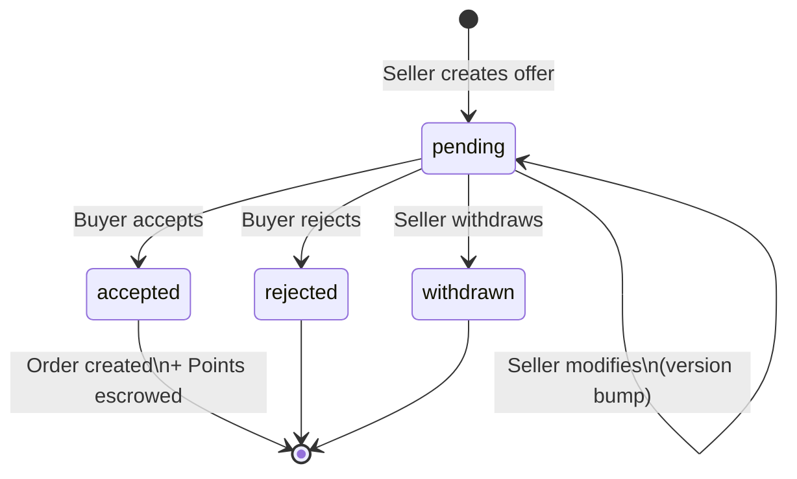
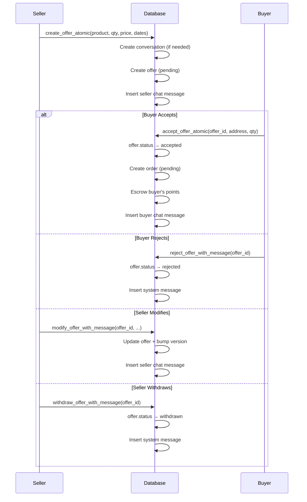
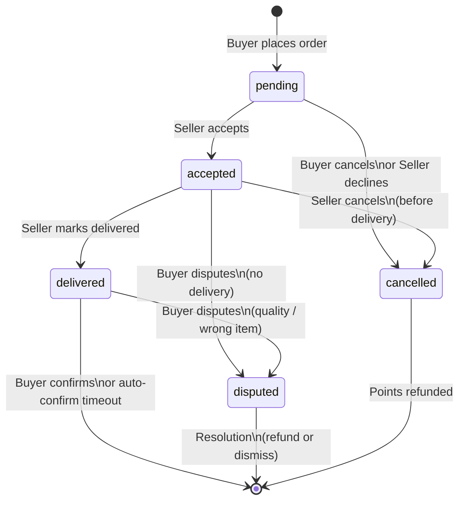
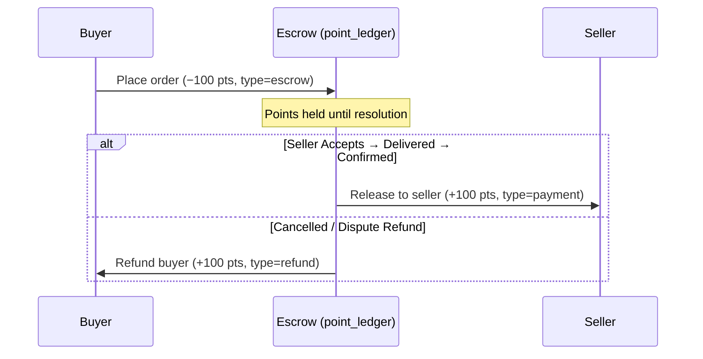

# Offer & Order Lifecycle

This document defines the complete offer and order lifecycles, including state
transitions, point flows, and the roles of buyer and seller at each stage.

The transaction system supports **two distinct flows** depending on the post
type:

- **Sell posts** (`want_to_sell`): Buyer places an order directly →
  `create-order` edge function
- **Buy posts** (`want_to_buy`): Seller makes an offer → buyer accepts/rejects →
  order created on acceptance

---

## Offer Lifecycle (Buy-Post Flow)

When a seller responds to a buyer's `want_to_buy` post, they create an **offer**
rather than a direct order. The buyer then reviews and accepts/rejects.

### Offer Statuses

| Status      | Description                                         |
| :---------- | :-------------------------------------------------- |
| `pending`   | Offer submitted by seller. Awaiting buyer response. |
| `accepted`  | Buyer accepted → order created automatically.       |
| `rejected`  | Buyer declined the offer.                           |
| `withdrawn` | Seller withdrew before buyer responded.             |

### Offer State Diagram

### Offer Flow

### Offer RPCs

| Function                      | Actor  | Status   | Purpose                                                       |
| :---------------------------- | :----- | :------- | :------------------------------------------------------------ |
| `create_offer_atomic`         | Seller | ✅ Built | Creates conversation + offer + seller chat message atomically |
| `accept_offer_atomic`         | Buyer  | ✅ Built | Accepts offer, creates order, escrows points, buyer message   |
| `reject_offer_with_message`   | Buyer  | ✅ Built | Rejects offer, inserts system message                         |
| `withdraw_offer_with_message` | Seller | ✅ Built | Withdraws pending offer, inserts system message               |
| `modify_offer_with_message`   | Seller | ✅ Built | Modifies pending offer (qty/price/dates/media), bumps version |

#### `create_offer_atomic`

**Signature**:
`create_offer_atomic(p_seller_id, p_buyer_id, p_post_id, p_quantity, p_points_per_unit, p_category, p_product, p_unit, p_delivery_date, p_message, p_seller_post_id, p_media, p_delivery_dates, p_community_h3_index, p_additional_community_h3_indices) → jsonb`

**Logic**:

1. Prevent self-offers
2. Resolve delivery dates (prefer array, fall back to single date)
3. Create or reuse conversation for `(post_id, buyer_id, seller_id)`
4. Check no active pending offer or active order exists
5. Insert offer row with all details
6. Insert seller chat message (shown as from seller, not system)
7. Return `{ offerId, conversationId }`

#### `accept_offer_atomic`

**Signature**:
`accept_offer_atomic(p_offer_id, p_buyer_id, p_delivery_address, p_delivery_instructions, p_quantity) → jsonb`

**Logic**:

1. Lock and fetch offer, verify `pending` status
2. Verify caller is the buyer (conversation buyer)
3. Validate delivery address is provided
4. Use buyer's requested quantity (default: full offer quantity, must not exceed
   offer)
5. Calculate total price using buyer's quantity × points per unit
6. Check buyer's point balance ≥ total price
7. Mark offer as `accepted`
8. Create order in `pending` status
9. Escrow buyer's points (type=`escrow`)
10. Insert buyer chat message ("✅ Offer accepted! Order placed: ...")
11. Return `{ orderId, conversationId, newBalance }`

#### `reject_offer_with_message`

**Signature**: `reject_offer_with_message(p_offer_id, p_buyer_id) → jsonb`

**Logic**: Lock offer, verify pending + buyer, set status → `rejected`, insert
system message.

#### `withdraw_offer_with_message`

**Signature**: `withdraw_offer_with_message(p_offer_id, p_seller_id) → jsonb`

**Logic**: Lock offer, verify pending + creator, set status → `withdrawn`,
insert system message.

#### `modify_offer_with_message`

**Signature**:
`modify_offer_with_message(p_offer_id, p_seller_id, p_quantity, p_points_per_unit, p_delivery_date, p_message, p_media, p_delivery_dates, p_community_h3_index, p_additional_community_h3_indices) → jsonb`

**Logic**: Lock offer, verify pending + creator, update changed fields, bump
version, insert seller message with change summary ("✏️ Offer modified: qty: 5 →
3, price: 10 → 8 pts").

---

## Order Lifecycle

Orders are created either:

- **Directly** from sell posts via `create-order` edge function (invoked from
  `OrderSheet.tsx`)
- **From accepted offers** on buy posts via `accept_offer_atomic` SQL RPC

### Order Statuses

| Status      | Description                                                                            |
| :---------- | :------------------------------------------------------------------------------------- |
| `pending`   | Order placed by buyer. Points escrowed. Awaiting seller acceptance.                    |
| `accepted`  | Seller has accepted the order. Points still in escrow. Delivery expected.              |
| `delivered` | Seller marked delivery complete. Buyer confirms, or auto-confirms after timeout.       |
| `disputed`  | Buyer raised a dispute. Escalation flow begins.                                        |
| `cancelled` | Order cancelled (by buyer before acceptance, or by seller declining). Points refunded. |

### Order State Diagram

---

## Point Flow (Escrow Model)

Points are **never transferred directly** between buyer and seller. Instead they
flow through an escrow pattern tied to the order lifecycle.

### Point Transaction Types

| Type      | When                                            | Amount      | Description                   |
| :-------- | :---------------------------------------------- | :---------- | :---------------------------- |
| `escrow`  | Order placed (`pending`)                        | −N (buyer)  | Buyer's points held in escrow |
| `payment` | Order completed (delivered + confirmed)         | +N (seller) | Seller receives points        |
| `refund`  | Order cancelled or dispute resolved with refund | +N (buyer)  | Points returned to buyer      |

### Flow by Transition

---

## Order Transition Rules

### `pending` → `accepted`

- **Actor:** Seller
- **RPC function:** `accept_order_versioned(order_id, expected_version)`
- **Point action:** None — points remain in escrow
- **Version check:** Returns `VERSION_MISMATCH` if buyer modified the order
  since seller last viewed it
- **Side effects:** System message in conversation (with unit), reduces
  `want_to_sell_details.total_quantity_available`

### `pending` → `cancelled`

- **Actor:** Buyer (cancels) or Seller (declines)
- **RPC function:** `cancel_order_with_message(order_id, user_id)` or
  `reject_order_versioned(order_id, expected_version)`
- **Point action:** Refund buyer (type=`refund`, +N points)
- **Side effects:** System message in conversation (`sender_id = null`,
  `type = 'system'`); restores quantity if order was `accepted`

### `accepted` → `delivered`

- **Actor:** Seller
- **RPC function:**
  `mark_delivered(order_id, seller_id, proof_url, proof_location)`
- **Point action:** None yet — buyer must confirm first
- **Side effects:** Delivery proof stored (URL, geo location, timestamp), system
  message prompts buyer to confirm

### `accepted` → `cancelled`

- **Actor:** Seller (before delivery)
- **Point action:** Refund buyer
- **Side effects:** Same as pending→cancelled

### `accepted` → `disputed`

- **Actor:** Buyer (if seller hasn't delivered by expected date)
- **Point action:** None — points remain in escrow pending resolution
- **Side effects:** Escalation record created

### `delivered` → confirmed (terminal)

- **Actor:** Buyer confirms, or auto-confirm after timeout (e.g. 48h)
- **RPC function:** `confirm_order_delivery(order_id, buyer_id)`
- **Point action:** Release escrow to seller minus 10% platform fee
  (type=`payment`, +N points; type=`platform_fee`, −fee)
- **Side effects:** Role-specific system messages with `visible_to` metadata:
  buyer sees escrow release confirmation, seller sees payout details

### `delivered` → `disputed`

- **Actor:** Buyer (wrong item, quality issue, etc.)
- **RPC function:** `create_escalation(order_id, buyer_id, reason, proof_url)`
- **Point action:** None — points remain in escrow pending resolution
- **Side effects:** Escalation record created, delivery proof reviewed

### `disputed` → resolved (terminal)

- **Actor:** Admin or automated resolution
- **RPC functions:** `create_refund_offer`, `accept_refund_offer_with_message`,
  `resolve_dispute_with_message`
- **Point action:** Either refund buyer or release to seller depending on
  resolution
- **Side effects:** Escalation closed, role-specific system messages with
  `visible_to` metadata (buyer sees refund details, seller sees payout details)

---

## Database Tables Involved

| Table           | Role                                          |
| :-------------- | :-------------------------------------------- |
| `offers`        | Offer record with lifecycle status            |
| `orders`        | Primary order record with `status` field      |
| `point_ledger`  | All point movements (escrow, payment, refund) |
| `conversations` | Chat thread between buyer and seller          |
| `chat_messages` | System messages for offer/order events        |
| `escalations`   | Dispute records                               |
| `refund_offers` | Refund negotiation during disputes            |

---

## All RPCs

### Offer RPCs

| Function                      | Status   | Type    | Purpose                                               |
| :---------------------------- | :------- | :------ | :---------------------------------------------------- |
| `create_offer_atomic`         | ✅ Built | SQL RPC | Creates conversation + offer + seller message         |
| `accept_offer_atomic`         | ✅ Built | SQL RPC | Accepts offer, creates order, escrows points          |
| `reject_offer_with_message`   | ✅ Built | SQL RPC | Rejects offer, system message                         |
| `withdraw_offer_with_message` | ✅ Built | SQL RPC | Withdraws pending offer, system message               |
| `modify_offer_with_message`   | ✅ Built | SQL RPC | Modifies pending offer, bumps version, seller message |

### Order RPCs

| Function                           | Status   | Type      | Purpose                                     |
| :--------------------------------- | :------- | :-------- | :------------------------------------------ |
| `create-order`                     | ✅ Built | Edge func | Places order, escrows buyer points          |
| `accept_order_versioned`           | ✅ Built | SQL RPC   | Seller accepts with version check           |
| `reject_order_versioned`           | ✅ Built | SQL RPC   | Seller declines, refunds buyer              |
| `cancel_order_with_message`        | ✅ Built | SQL RPC   | Cancel by buyer or seller, refunds buyer    |
| `mark_delivered`                   | ✅ Built | SQL RPC   | Seller marks delivered with proof           |
| `confirm_order_delivery`           | ✅ Built | SQL RPC   | Buyer confirms receipt, releases escrow     |
| `create_escalation`                | ✅ Built | SQL RPC   | Buyer disputes order                        |
| `create_refund_offer`              | ✅ Built | SQL RPC   | Counter-offer during dispute                |
| `accept_refund_offer_with_message` | ✅ Built | SQL RPC   | Accept refund, close escalation             |
| `resolve_dispute_with_message`     | ✅ Built | SQL RPC   | Resolve dispute without refund              |
| `modify_order`                     | ✅ Built | SQL RPC   | Buyer modifies pending order, bumps version |

---

## Implementation Notes

- Orders are created via `create-order` edge function invoked from
  `OrderSheet.tsx` (sell posts) or via `accept_offer_atomic` RPC (buy posts)
- The `OrderSheet` shows a "Buy Points & Submit" flow when buyer has
  insufficient balance
- Points are escrowed immediately at order creation to prevent double-spending
- All lifecycle transitions use SQL RPC functions with `SECURITY DEFINER` and
  `FOR UPDATE` row-level locking to prevent race conditions
- Optimistic locking via `version` column prevents stale accept/reject when
  buyer modifies a pending order
- System messages are auto-inserted into conversations for every state change
  with unit-aware formatting (e.g., "2 dozen Tomatoes")
- **Role-specific messages**: `confirm_order_delivery`, `accept_refund_offer`,
  and `resolve_dispute` insert separate system messages for buyer and seller,
  each with `metadata.visible_to = <user_id>`. Client filters messages so each
  user only sees their relevant notification.
- **Cancel messages**: `cancel_order_with_message` inserts a single system
  message (visible to all) with `sender_id = null` and `type = 'system'`
- `orders` and `offers` tables are added to `supabase_realtime` publication with
  `REPLICA IDENTITY FULL` for live UI updates
- **Partial quantity acceptance**: When accepting an offer, the buyer can
  request a quantity less than or equal to the offer quantity. Price is
  calculated using the buyer's requested quantity × points per unit.
