# Order Lifecycle & State Transitions

This document defines the complete order lifecycle, including state transitions,
point flows, and the roles of buyer and seller at each stage.

## Order Statuses

| Status      | Description                                                                            |
| :---------- | :------------------------------------------------------------------------------------- |
| `pending`   | Order placed by buyer. Points escrowed. Awaiting seller acceptance.                    |
| `accepted`  | Seller has accepted the order. Points still in escrow. Delivery expected.              |
| `delivered` | Seller marked delivery complete. Buyer confirms, or auto-confirms after timeout.       |
| `disputed`  | Buyer raised a dispute. Escalation flow begins.                                        |
| `cancelled` | Order cancelled (by buyer before acceptance, or by seller declining). Points refunded. |

---

## State Transition Diagram

---

## Point Flow (Escrow Model)

Points are **never transferred directly** between buyer and seller. Instead they
flow through an escrow pattern tied to the order lifecycle.

### Point Transaction Types

| Type      | When                                            | Amount      | Description                   |
| :-------- | :---------------------------------------------- | :---------- | :---------------------------- |
| `escrow`  | Order placed (`pending`)                        | −N (buyer)  | Buyer's points held in escrow |
| `payment` | Order completed (delivered + confirmed)         | +N (seller) | Seller receives points        |
| `refund`  | Order cancelled or dispute resolved with refund | +N (buyer)  | Points returned to buyer      |

### Flow by Transition

```mermaid
sequenceDiagram
    participant B as Buyer
    participant E as Escrow (point_ledger)
    participant S as Seller

    B->>E: Place order (−100 pts, type=escrow)
    Note over E: Points held until resolution

    alt Seller Accepts → Delivered → Confirmed
        E->>S: Release to seller (+100 pts, type=payment)
    else Cancelled / Dispute Refund
        E->>B: Refund buyer (+100 pts, type=refund)
    end
```

---

## Transition Rules

### `pending` → `accepted`

- **Actor:** Seller
- **Edge function:** `accept-order` _(not yet built)_
- **Point action:** None — points remain in escrow
- **Side effects:** System message in conversation, notification to buyer

### `pending` → `cancelled`

- **Actor:** Buyer (cancels) or Seller (declines)
- **Edge function:** `cancel-order` _(not yet built)_
- **Point action:** Refund buyer (type=`refund`, +N points)
- **Side effects:** System message in conversation, notification to counterparty

### `accepted` → `delivered`

- **Actor:** Seller
- **Edge function:** `mark-delivered` _(not yet built)_
- **Point action:** None yet — buyer must confirm first
- **Side effects:** Delivery proof optional (media upload), notification to
  buyer to confirm

### `accepted` → `cancelled`

- **Actor:** Seller (before delivery)
- **Point action:** Refund buyer
- **Side effects:** Same as pending→cancelled

### `accepted` → `disputed`

- **Actor:** Buyer (if seller hasn't delivered by expected date)
- **Point action:** None — points remain in escrow pending resolution
- **Side effects:** Escalation record created

### `delivered` → confirmed (terminal)

- **Actor:** Buyer confirms, or auto-confirm after timeout (e.g. 48h)
- **Point action:** Release escrow to seller (type=`payment`, +N points)
- **Side effects:** System message, ratings prompt

### `delivered` → `disputed`

- **Actor:** Buyer (wrong item, quality issue, etc.)
- **Point action:** None — points remain in escrow pending resolution
- **Side effects:** Escalation record created, delivery proof reviewed

### `disputed` → resolved (terminal)

- **Actor:** Admin or automated resolution
- **Point action:** Either refund buyer or release to seller depending on
  resolution
- **Side effects:** Escalation closed, notification to both parties

---

## Database Tables Involved

| Table           | Role                                          |
| :-------------- | :-------------------------------------------- |
| `orders`        | Primary order record with `status` field      |
| `offers`        | The offer that generated this order           |
| `point_ledger`  | All point movements (escrow, payment, refund) |
| `conversations` | Chat thread between buyer and seller          |
| `chat_messages` | System messages for order events              |
| `escalations`   | Dispute records                               |
| `refund_offers` | Refund negotiation during disputes            |

---

## Edge Functions (Current & Planned)

| Function            | Status     | Purpose                                 |
| :------------------ | :--------- | :-------------------------------------- |
| `create-order`      | ✅ Built   | Places order, escrows buyer points      |
| `accept-order`      | 🔲 Planned | Seller accepts pending order            |
| `cancel-order`      | 🔲 Planned | Cancel/decline order, refund buyer      |
| `mark-delivered`    | 🔲 Planned | Seller marks delivery complete          |
| `confirm-delivery`  | 🔲 Planned | Buyer confirms receipt, releases escrow |
| `create-escalation` | 🔲 Planned | Buyer disputes order                    |

---

## Current Implementation Notes

- Orders are created via `create-order` edge function invoked from
  `OrderSheet.tsx`
- The `OrderSheet` shows a "Buy Points & Submit" flow when buyer has
  insufficient balance
- Points are escrowed immediately at order creation to prevent double-spending
- Seller credit and acceptance UI are **not yet implemented**
