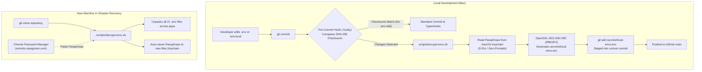

# Local Secrets & Environment Management in GitHub

This document outlines the architecture, security model, and usage instructions for managing local environment variables (`.env`, `.env.local`) across the CasaGrown monorepo using **AES-256 encrypted repository backups** synchronized with **macOS Keychain** and **Google Chrome Password Manager**.

---

## 1. Architectural Overview & Objectives

In a multi-app monorepo with 10+ workspaces (`next-market`, `next-admin`, `next-community-voice`, `next-metrics`, `expo-*`, `quarantine-bot`, `supabase`), managing local development secrets, test keys, and mock configurations presents two critical engineering challenges:

1. **Eliminate Single Point of Failure (SPoF)**: If a developer laptop is lost, formatted, or damaged, all uncommitted `.env.local` files and local test secrets must be fully recoverable from GitHub history in under 5 seconds.
2. **Zero Human Overhead (Automated Git Sync)**: Developers should never have to remember to run manual encryption scripts before committing. Git hooks must detect `.env` modifications automatically and keep the encrypted snapshot synchronized.
3. **Zero Cryptographic Key Management Inception**: The master decryption passphrase is protected by **Google Chrome Password Manager** (synced across all devices via Google Account and biometric Touch ID / Face ID) and cached in **macOS Keychain** for seamless local execution.

---

## 2. End-to-End System Architecture



---

## 3. Core Components

| Component | File Path | Purpose |
| :--- | :--- | :--- |
| **Encrypted Archive** | `secrets/local-envs.enc` | OpenSSL AES-256-CBC encrypted tarball containing all 21 `.env` & `.env.local` files. Committed to GitHub. |
| **Checksum Manifest** | `secrets/.env.checksums` | SHA-256 hash list of all environment files used by Git hooks for instant `<0.05s` change detection. |
| **Encryption Engine** | [`scripts/encrypt-envs.sh`](file:///Users/rkhona/development/quarantine_bot/casagrown-marketing-automation/scripts/encrypt-envs.sh) | Bundles all environment files, reads Keychain passphrase, and produces `secrets/local-envs.enc`. |
| **Decryption Engine** | [`scripts/decrypt-envs.sh`](file:///Users/rkhona/development/quarantine_bot/casagrown-marketing-automation/scripts/decrypt-envs.sh) | Unpacks archive, restores files to exact directories, and provisions new Mac Keychain. |
| **Git Pre-Commit Hook** | [`.husky/pre-commit`](file:///Users/rkhona/development/quarantine_bot/casagrown-marketing-automation/.husky/pre-commit) | Automatically verifies checksums and re-encrypts whenever any `.env` file is edited. |
| **Workspace Setup** | [`scripts/setup-workspace-2.sh`](file:///Users/rkhona/development/quarantine_bot/casagrown-marketing-automation/scripts/setup-workspace-2.sh) | Bootstraps worktrees and invokes decryption automatically if no local parent directory exists. |

---

## 4. Environment Files Included in Encrypted Archive

The encryption pipeline automatically discovers and archives all `.env` and `.env.local` files across the workspace:

1. **Root**: `/.env`
2. **Next.js Applications**:
   * `apps/next-market/.env` & `.env.local`
   * `apps/next-admin/.env` & `.env.local`
   * `apps/next-community-voice/.env` & `.env.local`
   * `apps/next-metrics/.env` & `.env.local`
   * `apps/next-community/.env` & `.env.local`
   * `apps/next-pro/.env` & `.env.local`
3. **Mobile & Universal Applications**:
   * `apps/expo-market/.env` & `.env.local`
   * `apps/expo-admin/.env` & `.env.local`
   * `apps/expo-community/.env` & `.env.local`
   * `apps/quarantine-bot/.env` & `.env.local`
4. **Supabase Local & Edge Functions**:
   * `supabase/.env.local`
   * `supabase/functions/.env`

*(All `node_modules/`, `.git/`, and `.next/` directories are strictly excluded).*

---

## 5. Usage Guide

### Day-to-Day Development (100% Automated)
1. Edit any `.env` or `.env.local` file normally in your editor.
2. Run `git commit -m "your message"` (or use AI agent commit).
3. The `.husky/pre-commit` hook automatically detects the change, retrieves the passphrase from your Mac's Keychain, updates `secrets/local-envs.enc`, and commits it.

---

### Restoring on a Brand New Laptop (1 Step)
When setting up a fresh machine:
1. Clone the repository:
   ```bash
   git clone https://github.com/rahulkhona/casagrown3.git
   cd casagrown3
   ```
2. Run the decryption script:
   ```bash
   ./scripts/decrypt-envs.sh
   ```
3. Enter your passphrase when prompted *(lookup in Chrome Password Manager under `secrets.casagrown.com`)*.
4. **Done!** All `.env` files are restored, and the passphrase is automatically saved to the new Mac's Keychain for future automated commits.

---

### Manual Encryption / Decryption Commands
* **Manually re-encrypt environment files**:
  ```bash
  ./scripts/encrypt-envs.sh
  ```
* **Manually decrypt / restore environment files**:
  ```bash
  ./scripts/decrypt-envs.sh
  ```

---

### Managing the Passphrase in Chrome Password Manager
* **Location in Chrome**: `chrome://password-manager/passwords` (or [passwords.google.com](https://passwords.google.com))
* **Website Entry**: `secrets.casagrown.com`
* **Username**: `rkhona`
* **Password**: Master encryption passphrase

---

### Updating the Passphrase in macOS Keychain
If you ever change your master passphrase:
```bash
security add-generic-password -U -a "$USER" -s "casagrown-envs-passphrase" -w "<new-passphrase>"
./scripts/encrypt-envs.sh
git add secrets/local-envs.enc secrets/.env.checksums && git commit -m "chore: rotate environment encryption passphrase"
```

---

## 6. Security & Cryptographic Guarantees

1. **Symmetric Cipher**: OpenSSL `AES-256-CBC` with **PBKDF2** (Password-Based Key Derivation Function 2) and cryptographic salt.
2. **Git Leak Prevention**: Unencrypted `.env` and `.env.local` files are included in `.gitignore` and are never committed as plaintext to Git history.
3. **Local Keychain Protection**: The passphrase in macOS Keychain is bound to your macOS user login and protected by Apple's local Secure Enclave / biometric authentication.
